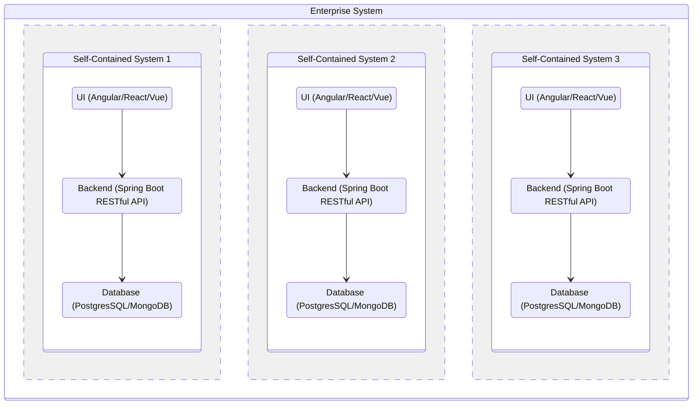
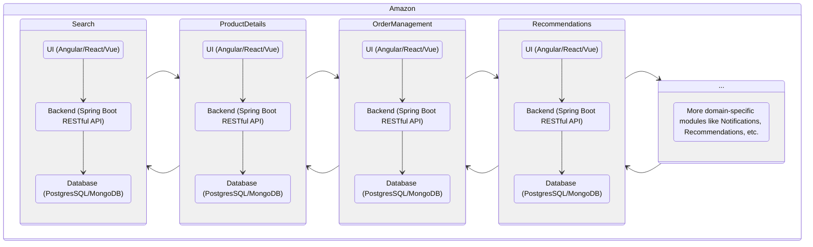

# Self-Contained Systems Architecture in Practice: Wins and Challenges

## Introduction

Scaling an enterprise system always sounds clean on slides — until you live through it. We started with clear layers and
modular services. But over time, shared frontends, tangled databases, and cross-team blockers slowed everything down.

Microservices got us partway there, but they didn’t solve the coordination overhead. That’s when we embraced
**Self-Contained Systems (SCS)** — not because it was trendy, but because we needed real independence across frontend,
backend, and database.

In this post, I’ll share how we used Spring Boot, Angular/React, and PostgresSQL/MongoDB to build SCSs that helped us
ship faster, reduce risk, and scale smarter — plus the pitfalls we ran into and how we overcame them.

## What is SCS?

The textbook definitions of [Self-Contained Systems (SCS)](https://scs-architecture.org/):
> An architectural approach that separates a larger system's functionality into many independent, collaborating systems.

In our words:

A **Self-Contained System (SCS)** is a vertical slice of your application that owns everything it needs: its own
frontend, backend, and database. It can be developed, deployed, and scaled independently. No waiting on other teams. No
shared release pipelines.

A simple analogy:

> If a monolith is a giant "all-in-one restaurant" and microservices are individual "food counters" inside a mall food
> court, then SCS is a full small restaurant — complete kitchen, waiters, tables, and a door you can walk into — next to
> other small restaurants.



Each **Self-Contained System (SCS)**:

- Has its own UI (frontend if needed).
- Has its own backend logic.
- Has its own database (or persistent storage).
- Can be deployed independently of others.
- Communicates with other systems only when necessary, often asynchronously (like via messaging or events).

## Why people use SCS?

- To make systems easier to evolve, you don't need to touch the whole big system to change something.
- To allow teams to work independently.
- To reduce deployment risks, you deploy small parts, not the whole monster app.
- To simplify scaling, scale only the parts that need it.

## SCS vs Microservices

Self-Contained Systems (SCS) and microservices are both architectural styles that promote modularity and independence,
but they differ in their approach and scope.

| Feature       | Self-Contained System (SCS)        | Microservices                                |
|---------------|------------------------------------|----------------------------------------------|
| Size          | Bigger (whole user-visible system) | Smaller (one function or feature)            |
| Deployment    | Deployable individually            | Deployable individually                      |
| UI            | Often has its own UI               | Typically backend only                       |
| Independence  | Very strong                        | Strong, but often more interdependent        |
| Communication | Fewer, asynchronous preferred      | Lots, synchronous (like REST APIs) is common |
| Aim           | End-to-end feature delivery        | Specific business capability                 |
| Ownership     | End-to-end feature team ownership  | Often shared ownership across teams          |
| Scaling       | Can scale independently            | Can scale independently                      |

## Example Use case: Amazon

Let's imagine Amazon and apply Self-Contained Systems (SCS) thinking to it.

When you visit Amazon, you see different parts:

- Home page (banners, suggestions)
- Search
- Product page (descriptions, reviews)
- Cart
- Payments
- Order history
- And more...

In a Self-Contained System (SCS) architecture: Each of these parts could be a separate system, like this:



| Part of Amazon    | Possible SCS                                               |
|-------------------|------------------------------------------------------------|
| Search Engine     | A system that handles search queries, suggestions, filters |
| Product Details   | A system that shows product info, specs, reviews           |
| Shopping Cart     | A system that handles cart actions (add/remove/view)       |
| Checkout/Payments | A system for checkout steps, payment processing            |
| Order Management  | A system to track orders, shipping updates                 |
| Recommendations   | A system that suggests products based on user behavior     |
| Notifications     | A system that sends emails, push notifications             |
| User Profile      | A system that manages user accounts, preferences           |

**Key Amazon + Self-Contained System architecture points:**

- If the Search system needs an update (e.g., better filters), Amazon doesn't have to redeploy the Cart or Payments
  system.
- If the Cart system is overwhelmed on Black Friday, Amazon can scale just that system.
- Different teams can own different systems — Search team, Payments team, Cart team — all moving fast without blocking
  each other.
- If one system fails (say Recommendations), the rest (like Checkout) still work — improving reliability.
- If Amazon wants to add a new feature (like a new payment method), it can do so in the Payments system without touching
  the Cart or Search systems.

## SCS in Practice

### Our transition to SCS

Before SCS, we were working in a typical "microservice-ish" setup: backend split into services, but all tied together by
a shared frontend and a few common databases. On paper, it looked modular. In practice, it was a mess.

We didn’t rewrite everything overnight. We picked one painful area — a feature set that constantly needed changes — and
turned it into our first SCS.

How we broke it down:

- **Backend**: A standalone Spring Boot service, owning its business logic end-to-end.
- **Frontend**: A separate Angular/React app — no shared codebase, no shared UI framework.
- **Database**: Its own PostgresSQL schema. No joins across SCS boundaries. If we needed data, we fetched it through
  APIs or events.

Each SCS became a **product inside the product** — fully owned by a team, built and released independently.

We used Docker to containerize everything. CI/CD pipelines were isolated. No more waiting on a global release train.
Each team had control from commit to production.

We didn't aim for "perfect boundaries" — we aimed for **autonomy with purpose**. We made sure that each SCS could evolve
independently but still fit into the larger system.

### Implementations

Here's a simple high level journey of how we set up a Self-Contained System (SCS),
using a hypothetical **Order Service** as an example.

The **Order Service** is,

- a self-contained system that handles everything related to orders
- a Spring Boot backend with REST APIs
- an Angular frontend
- a PostgresSQL database
- a Docker container for deployment
- a Flyway for database migrations
- a Kafka for event-driven communication
- a AsciiDoc for API documentation
- a GitHub Action CI/CD pipeline for continuous integration and deployment

We used a monorepo approach to manage the codebase, with separate directories (maven modules) for the backend and
frontend.

The maven multi-module project directory structure looks like this:

```text
order-service/
├── order-service-backend/
│   ├── src/
│   │   ├── main/
│   │   │   ├── java/com/example/order/
│   │   │   │   ├── OrderServiceApplication.java
│   │   │   │   ├── config/                # CORS, security, OpenAPI
│   │   │   │   ├── controller/            # REST APIs (exposed only for this SCS or events)
│   │   │   │   ├── service/               # Business logic
│   │   │   │   ├── domain/                # Entities, enums, value objects
│   │   │   │   ├── repository/            # Spring Data JPA / Mongo Repositories
│   │   │   │   ├── integration/           # External API clients (REST templates, Feign, etc.)
│   │   │   │   └── event/                 # Event producers / consumers
│   │   └── resources/
│   │       ├── application.yml
│   │       └── db/migration/             # Flyway/Liquibase scripts
│   ├── Dockerfile
│   └── pom.xml / build.gradle
│
├── order-service-frontend/
│   ├── src/
│   │   ├── app/
│   │   │   ├── core/                     # Services, interceptors
│   │   │   ├── features/                 # Feature modules (e.g., order-list, order-create)
│   │   │   ├── shared/                   # Shared components, pipes, directives
│   │   │   ├── app-routing.module.ts
│   │   │   └── app.component.ts / html
│   ├── environments/
│   │   └── environment.prod.ts / dev.ts
│   ├── angular.json
│   ├── Dockerfile                        # Optional, if dedicated deployment is needed for frontend
│   └── package.json
│
├── docker-compose.yml                    # Local development with DB and dependencies
├── README.md
└── .github/workflows/ci-cd.yml           # GitHub Action pipeline

```

!!! note "Note"

    - The above directory structure is a simplified version. In a real-world scenario, you might have more
      directories for tests, documentation, and other resources.
    - Order Service is just an example. You can have multiple SCSs like Cart Service, Payment Service, etc.
    - Order Service package both frontend and backend together as a single deployable container. You can also have
      separate containers for frontend and backend if needed.

### Key Points in Implementation

- **Backend**: Dedicated maven module for [Spring Boot application](https://spring.io/projects/spring-boot) which serves
  frontend resources and handle event producers/consumers, and a database migration tool
  like [Flyway](https://github.com/flyway/flyway) or [Liquibase](https://www.liquibase.com/).
- **Database**: Each SCS has its own
  database  [PostgresSQL](https://www.postgresql.org/) / [MongoDB](https://www.mongodb.com/) / [Cassandra](https://cassandra.apache.org/_/index.html).
  We used a separate schema for each SCS to avoid shared databases.
- **Frontend**: Dedicated module for Angular app with feature modules, shared components, and a core module for
  services. Some SCSs may not have a frontend at all, but if they do, we
  used [Angular](https://angular.dev/) / [React](https://react.dev/) to build the UI.
- **UI Shared Components**: We created a shared library for common components (like theme, brandings, buttons, modals,
  etc.) to avoid duplication and to have unified design across SCSs. This library can be published as an NPM package and
  used in multiple SCSs.
- **Authentication**: We used Single Sign On(SSO), OAuth2 & JWT based stateless authentication to unify authentication
  across SCS.
  We used [Spring Security](https://spring.io/projects/spring-security) for authentication and authorization. Each SCS
  has
  its own security configuration.
- **API Documentation**: We used [AsciiDoc](https://docs.asciidoctor.org/asciidoc/latest/)
  with [SpringRestDocs](https://spring.io/projects/spring-restdocs) for API documentation. Each SCS has its own API
  documentation, which is generated automatically from the code.
- **Event-Driven Communication**: We used [Kafka](https://spring.io/projects/spring-kafka)
  with [Spring Kafka](https://spring.io/projects/spring-kafka) for event-driven communication between SCSs. Each SCS can
  publish and subscribe to events independently.
- **Docker**: Each SCS has its own [Dockerfile](https://docs.docker.com/reference/dockerfile/) for containerization. We
  packaged both frontend and backend together as a single deployable container. We
  used [Frontend Maven Plugin](https://github.com/eirslett/frontend-maven-plugin) to build the frontend and package it
  with the backend.
- **Local Development**: We used [Docker Compose](https://docs.docker.com/compose/)
  with [SpringBoot support](https://docs.spring.io/spring-boot/how-to/docker-compose.html) to set up a local development
  environment. Each SCS has its own Docker Compose file to spin up the whole SCS with its dependencies (like
  PostgresSQL).
- **CI/CD**: Each SCS has its own CI/CD pipeline (like GitHub Actions). We set up pipelines to build,
  test, and deploy each SCS independently.
- **Testing**: We used unit tests for individual components for both frontend and backend. Integration tests with
  [Testcontainers](https://testcontainers.com/) for the whole SCS. We also set up contract testing
  with [Spring Cloud Contract](https://spring.io/projects/spring-cloud-contract) to ensure that APIs
  between SCSs were compatible.
- **Monitoring**: We used tools like Prometheus and Grafana for monitoring each SCS independently. Each SCS has its own
  monitoring setup to track performance, errors, and other metrics.

!!! tip "Tip"

    [JHipster](https://www.jhipster.tech/) is a great tool to generate a Spring Boot + Angular/React + Database
    application with Docker support. You can use it to kickstart your SCS development.

### Real Benefits We Experienced

- **Independent & Faster Deployments**: Teams could ship features on their own schedule. No more syncing across services
  or waiting for "release windows".
- **Faster Development**: Frontend and backend evolved in sync. If we needed a new API, we just built it — no waiting on
  another team.
- **Reduced Complexity**: Each SCS was a smaller, more manageable codebase. We could focus on one part of the system
  without worrying about the whole thing.
- **Domain-Driven Structure**: SCS aligned perfectly with our business domains. Product features mapped directly to
  technical boundaries.
- **Easier Troubleshooting**: Since we kept each system isolated, debugging issues became faster. You knew exactly where
  to look.
- **Less Risky Changes**: Because each SCS was loosely coupled, changes in one didn't break the rest. It reduced blast
  radius and boosted confidence.
- **Scalability**: We could scale individual SCS based on demand. If the Cart system was under heavy load, we could
  scale just that one.
- **Better Testing**: Each SCS could be tested independently. We could run unit tests, integration tests, and end-to-end
  tests without worrying about the whole system.
- **Reduced Technical Debt**: As we evolved, we could refactor and improve each SCS without worrying about the whole
  system. It allowed us to pay down technical debt incrementally.

### Challenges We Faced & Solutions

- **Cross-SCS Communication**: SCSs are isolated by design, but features often span boundaries. Syncing data or
  triggering workflows across systems brought tough decisions: REST? Messaging? Duplication?
    - **Solution**: We used a mix of REST APIs for synchronous calls and event-driven architecture (like Kafka) for
      asynchronous communication.
    - We also defined clear contracts and APIs to minimize coupling.
- **UI Fragmentation**: Each SCS had its own UI, leading to a fragmented user experience. We had to ensure that the
  overall experience was consistent and cohesive.
    - **Solution**: We created a design system and style guide to ensure consistency across UIs.
    - We used UI composition techniques (like iframes or micro frontends) to integrate UIs when needed.
- **Data Duplication & Sync**: We moved away from shared databases, but that meant duplicating some data between
  systems. Keeping it consistent was tricky — especially when events failed or arrived late.
    - **Solution**: We embraced eventual consistency. We used event sourcing to manage data across systems.
- **Testing Across Boundaries**: Unit tests were easy. Test containers helped with integration tests. But end-to-end
  testing across SCSs was a challenge. We had to ensure that the whole system worked together, even if each part was
  isolated.
    - **Solution**: We used contract testing (like interface testing) to ensure that APIs between SCSs were compatible.
- **Dev & CI/CD Complexity**: Multiple apps meant more pipelines, more configs, more moving parts. Local development
  also needed better tooling.
    - **Solution**: We invested in good local dev setups. Each SCS had its own Docker Compose file for local testing.
    - We used CI/CD tools (like GitLab or GitHub Actions) to manage pipelines for each SCS independently.

## Conclusion

Self-Contained Systems (SCS) are a game-changer for scaling complex enterprise systems. They give teams autonomy,
independence, and faster delivery — but only if done right. SCS isn’t a quick fix; it’s about evolving your architecture
as you go.

We didn’t start with SCS. We learned from real pain points, tackled challenges like cross-SCS communication and UI
fragmentation, and saw huge benefits in faster releases and clearer ownership.

For architects and senior devs: start small, learn from the journey, and let SCS give your teams the freedom to scale
independently. When done right, it’s a powerful way to break free from coordination bottlenecks and deliver at speed.

**Self-Contained Systems isn’t just an architecture — it’s a mindset shift that unlocks true team independence.**

## References

- [Self-Contained Systems (SCS) Architecture](https://scs-architecture.org/)
- [:fontawesome-brands-youtube: Simon Martinelli - Goodbye Microservices, Hello Self-Contained Systems](https://www.youtube.com/watch?v=Jjrencq8sUQ)
