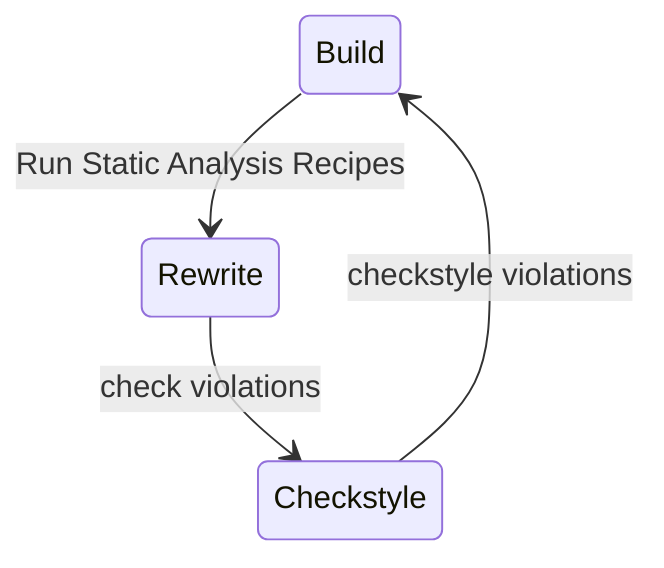
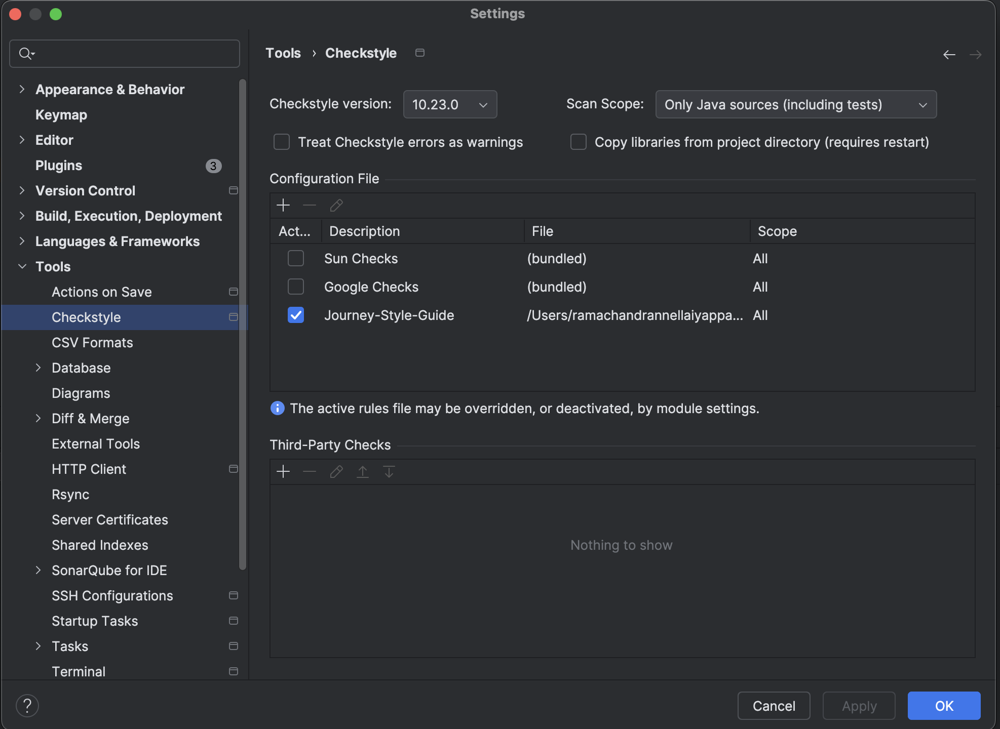
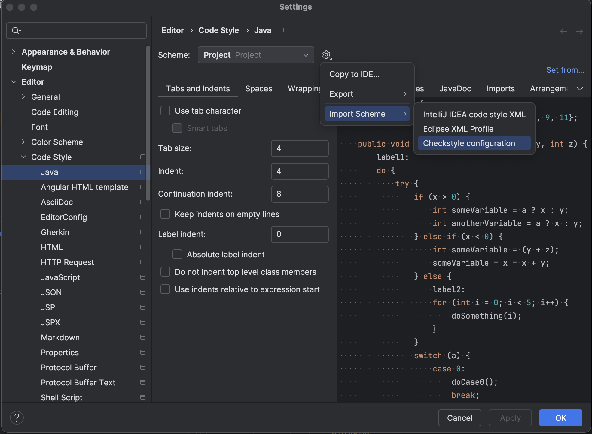
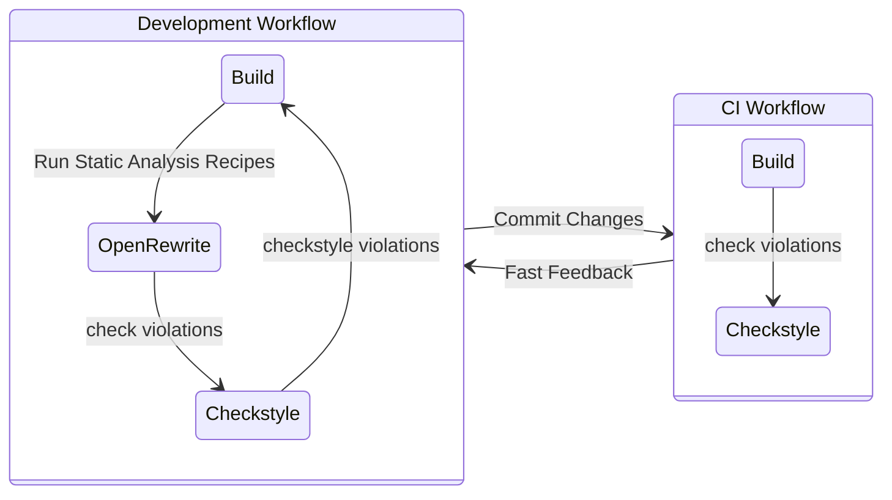

# Automating Java Style Guide Enforcement with Checkstyle and OpenRewrite

**TL;DR**:
Checkstyle is a powerful static code analysis tool that helps developers consistently enforce coding
standards and best practices in Java projects. When integrated with OpenRewrite, it enables automated code style
enforcement and seamless improvements to code quality. This article offers a comprehensive overview of Checkstyle,
guides you through its integration with OpenRewrite, and explains how to configure and customize rules tailored to your
projects.

## Introduction

In fast-moving development teams, maintaining **clean, consistent, and secure code** isn't just about writing better
code — it's about enforcing it automatically. Linters like **Checkstyle** help highlight violations of coding standards.

But here's the challenge many teams face: Checkstyle tells you what's wrong, but it doesn't fix it. Developers get the
warning, maybe even a failed build — but unless fixing it is frictionless, these issues often get pushed down the
backlog.

That's where combining [Checkstyle](https://checkstyle.sourceforge.io/) and [OpenRewrite](https://docs.openrewrite.org/)
becomes powerful.

This article walks through how to:

- Enforce consistent style and code quality with Checkstyle
- Use OpenRewrite to automatically refactor and fix code based on those rules
- Integrate both tools into your IDE, build system, and CI/CD pipeline
- Create custom rules to enforce your team's coding standards
- Suppress rules for specific cases without cluttering your codebase

### Checkstyle

Checkstyle is a static code analysis tool for Java that helps developers follow coding standards by checking source code
against a defined set of rules.

It's widely used to:

- Enforce formatting (indentation, import order, braces)
- Catch common mistakes (magic numbers, unused imports, redundant modifiers)
- Ensure code quality (Javadoc comments, naming conventions, cyclomatic complexity)
- Promote best practices (final variables, method length, class design)
- Detect potential bugs (null checks, exception handling, resource management)
- Encourage consistency (line length, whitespace, naming conventions)
- Facilitate code reviews (automated checks, reporting, integration with CI/CD)

### OpenRewrite

[OpenRewrite](https://docs.openrewrite.org/) is a powerful-automated refactoring tool for Java (and other JVM languages)
that analyzes source code using an Abstract Syntax Tree (AST) and applies safe, opinionated transformations.

Unlike linters, it doesn't just tell you what’s wrong — it actually **rewrites your code** for you.

It excels at:

- Refactoring large codebases (e.g., migrating to new libraries, updating APIs)
- Enforcing best practices (like enforcing logging standards, removing unused code)
- Updating dependencies (like changing package names, updating method calls)
- Enforcing security standards (like removing deprecated APIs, updating to secure libraries)
- Fixing code smells (like simplifying complex expressions, removing redundant code)
- Integrating with CI/CD pipelines (like running checks and applying fixes automatically)

OpenRewrite bridges the gap between code quality **enforcement and automation**.

### Checkstyle with OpenRewrite

While **Checkstyle flags violations** and **OpenRewrite fixes code**, the real magic happens when you combine them
strategically.

Imagine this workflow:



- Define your code style rules in `checkstyle.xml`
- Run Checkstyle during development and CI to detect violations
- Use OpenRewrite recipes to automatically fix those violations
- Automate both steps in your CI pipeline to ensure code is clean, consistent, and secure before merge

**This creates a fast feedback loop**: developers are warned about issues early, and those issues can be automatically
corrected — reducing friction, manual fixes, and code review overhead.

## Getting Started

Before jumping into automated code cleanup and refactoring, let’s get both tools — Checkstyle and OpenRewrite — up and
running in your project.

### Prerequisites

Make sure your development environment includes the following:

- Java installed - version 21 or higher
- Maven or Gradle build tool
- IDE (e.g., IntelliJ IDEA, Eclipse)

### Setup Style Guide

A **Style Guide** is a set of rules and conventions that define how code should be written and formatted.
It covers everything from naming conventions, formatting, and documentation to best practices for writing clean,
maintainable code.

Two popular Java style guides are available out of the box:

- [Google Java Style Guide](https://github.com/checkstyle/checkstyle/blob/master/src/main/resources/google_checks.xml)
- [Sun(Oracle) Java Style Guide](https://github.com/checkstyle/checkstyle/blob/master/src/main/resources/sun_checks.xml)

You can use either of these as a starting point for your Checkstyle configuration.
You can also create your own custom rules based on your team needs by defining them in an XML file.

!!! tip "Checkstyle Configuration"

    Checkstyle configuration is typically done in an XML file named `checkstyle.xml` and Store it under `config/checkstyle/checkstyle.xml` to keep your configuration clean and organized.

### Setup Checkstyle

Add the Checkstyle dependency to your `pom.xml` file.

```xml

<plugin>
    <groupId>org.apache.maven.plugins</groupId>
    <artifactId>maven-checkstyle-plugin</artifactId>
    <version>${maven-checkstyle-plugin.version}</version>
    <configuration>
        <configLocation>config/checkstyle/checkstyle.xml</configLocation>
    </configuration>
    <dependencies>
        <dependency>
            <groupId>com.puppycrawl.tools</groupId>
            <artifactId>checkstyle</artifactId>
            <version>${checkstyle.version}</version>
        </dependency>
    </dependencies>
</plugin>
   ```

### Setup OpenRewrite

Add the OpenRewrite plugin to your pom.xml:

```xml

<plugin>
    <groupId>org.openrewrite.maven</groupId>
    <artifactId>rewrite-maven-plugin</artifactId>
    <version>${rewrite-maven-plugin.version}</version>
    <configuration>
        <activeRecipes>
            <recipe>org.openrewrite.staticanalysis.CommonStaticAnalysis</recipe>
            <recipe>org.openrewrite.staticanalysis.CodeCleanup</recipe>
        </activeRecipes>
    </configuration>
    <dependencies>
        <!-- plugin dependencies -->
        <dependency>
            <groupId>org.openrewrite.recipe</groupId>
            <artifactId>rewrite-static-analysis</artifactId>
            <version>${rewrite-static-analysis.version}</version>
        </dependency>
    </dependencies>
</plugin>
```

OpenRewrite recipes are configured in the `<activeRecipes>` section of your `pom.xml`.

OpenRewrite has a number of built-in recipes for common static analysis tasks, such as:

- Removing unused imports
- Reformatting code
- etc.

The most common recipes are available in the `rewrite-static-analysis` module.

Please refer to the [OpenRewrite documentation](https://docs.openrewrite.org/) for a complete list of available recipes.

!!! tip "OpenRewrite Configuration"

    We have created detailed dedicated documentation for OpenRewrite Integration. Please refer to the
    [OpenRewrite Integration](https://nramc.github.io/my-notes/blog/open-rewrite.html) for more information.

### Run Checkstyle and OpenRewrite

Run Checkstyle:

```shell
mvn checkstyle:check
```

This will check your code against the rules defined in your `checkstyle.xml` file.
If there are any violations, Checkstyle will report them in the console output.

Run OpenRewrite:

```shell
mvn rewrite:run
```

This will apply the OpenRewrite recipes defined in your `pom.xml` file to your codebase.

Typical and Recommended development workflow is as follows:

1. Run Checkstyle first to identify violations
2. Run OpenRewrite to automatically fix what it can
3. Re-run Checkstyle to confirm cleanup
4. Review any remaining violations
5. Make manual fixes as needed
6. Commit the changes with confidence

## Tooling & Plugin

To make Checkstyle and OpenRewrite part of your daily development and CI/CD workflows, you’ll need the right tools and
plugins integrated into your IDE, build system, and automation pipeline. This section covers how to set up and use the
most common tooling effectively.

### Maven Plugin

Checkstyle and OpenRewrite are both available as Maven plugins, which makes them easy to integrate into your Maven
build process.

As mentioned earlier, you can add the Checkstyle & OpenRewrite plugins to your `pom.xml` file.

```xml

<plugins>
    <plugin>
        <groupId>org.openrewrite.maven</groupId>
        <artifactId>rewrite-maven-plugin</artifactId>
        <version>${rewrite-maven-plugin.version}</version>
        <configuration>
            <failOnDryRunResults>true</failOnDryRunResults>
            <activeRecipes>
                <recipe>org.openrewrite.staticanalysis.CommonStaticAnalysis</recipe>
                <recipe>org.openrewrite.staticanalysis.CodeCleanup</recipe>
            </activeRecipes>
        </configuration>
        <dependencies>
            <!-- plugin dependencies -->
        </dependencies>
    </plugin>
    <plugin>
        <groupId>org.apache.maven.plugins</groupId>
        <artifactId>maven-checkstyle-plugin</artifactId>
        <version>${maven-checkstyle-plugin.version}</version>
        <configuration>
            <configLocation>config/checkstyle/checkstyle.xml</configLocation>
        </configuration>
        <dependencies>
            <dependency>
                <groupId>com.puppycrawl.tools</groupId>
                <artifactId>checkstyle</artifactId>
                <version>${checkstyle.version}</version>
            </dependency>
        </dependencies>
    </plugin>
</plugins>
```

```shell
# Run Checkstyle
mvn checkstyle:check

# Run Checkstyle and generate report
mvn checkstyle:checkstyle

# Run OpenRewrite
mvn rewrite:run

# Run OpenRewrite without making changes
mvn rewrite:dryRun
```

### Checkstyle IDE Plugin

Checkstyle has plugins for popular IDEs like IntelliJ IDEA and Eclipse.

e.g., IntelliJ IDEA supports Checkstyle via
the [Checkstyle-IDEA plugin](https://plugins.jetbrains.com/plugin/1065-checkstyle-idea).

Setup steps:


1. Install the plugin via Settings > Plugins.
2. Navigate to `Settings > Tools > Checkstyle`.
3. Add a new configuration pointing to your checkstyle.xml file.

### IDE Code Style Settings

To ensure that your code style settings in IntelliJ IDEA match your Checkstyle rules, you can import the Checkstyle
configuration file directly into IntelliJ IDEA.



1. Go to `File > Settings > Editor > Code Style`.
2. Click on the gear icon next to the scheme dropdown and select `Import Scheme > Checkstyle Configuration File`.
3. Select your `checkstyle.xml` file and click `OK`.
4. Review the imported settings and adjust them as needed.
5. Click `Apply` and `OK` to save the changes.
6. You can now use the `Reformat Code` action (Ctrl + Alt + L) to apply the Checkstyle rules to your code.

### OpenRewrite IDE Plugin

OpenRewrite has plugins for popular IDEs like IntelliJ IDEA and Eclipse.
e.g., IntelliJ IDEA's [OpenRewrite plugin](https://plugins.jetbrains.com/plugin/23814-openrewrite) allows you to run
OpenRewrite recipes directly from the IDE.

This plugin is not required to run OpenRewrite, but it provides a convenient way to apply recipes and see the changes in
real-time.

## CI/CD Integration

Integrating Checkstyle and OpenRewrite into your CI/CD pipeline is crucial for maintaining code quality and
consistency across your development process.

We can configure Checkstyle and OpenRewrite maven plugins in your CI/CD pipeline to run automatically as part of your
build process. This ensures that code is checked for style violations and automatically refactored before it is merged
into the main branch.



!!! info "OpenRewrite in CI/CD Integration"

    The above diagram does not include OpenRewrite in the CI/CD pipeline. It is recommended to run OpenRewrite
    in the development environment and review changes before committing changes to the CI/CD pipeline. Thefore, the
    OpenRewrite step is not included in the CI/CD pipeline.

Adopt your `pom.xml` configuration to run Checkstyle and OpenRewrite as part of your CI/CD pipeline.

```xml

<plugins>

    <!-- Run OpenRewrite plugin in process-sources phase -->
    <plugin>
        <groupId>org.openrewrite.maven</groupId>
        <artifactId>rewrite-maven-plugin</artifactId>
        <version>${rewrite-maven-plugin.version}</version>
        <executions>
            <execution>
                <id>run-open-rewrite-execution</id>
                <goals>
                    <goal>runNoFork</goal>
                </goals>
                <phase>process-sources</phase>
            </execution>
        </executions>
        <configuration>
            <failOnDryRunResults>true</failOnDryRunResults>
            <activeRecipes>
                <recipe>org.openrewrite.staticanalysis.CommonStaticAnalysis</recipe>
                <recipe>org.openrewrite.staticanalysis.CodeCleanup</recipe>
            </activeRecipes>
        </configuration>
        <dependencies>
            <!-- plugin dependencies -->
            <dependency>
                <groupId>org.openrewrite.recipe</groupId>
                <artifactId>rewrite-static-analysis</artifactId>
                <version>${rewrite-static-analysis.version}</version>
            </dependency>
        </dependencies>
    </plugin>

    <!-- Run checkstyle plugin in verify phase -->
    <plugin>
        <groupId>org.apache.maven.plugins</groupId>
        <artifactId>maven-checkstyle-plugin</artifactId>
        <version>${maven-checkstyle-plugin.version}</version>
        <configuration>
            <configLocation>config/checkstyle/checkstyle.xml</configLocation>
        </configuration>
        <dependencies>
            <dependency>
                <groupId>com.puppycrawl.tools</groupId>
                <artifactId>checkstyle</artifactId>
                <version>${checkstyle.version}</version>
            </dependency>
        </dependencies>
        <executions>
            <execution>
                <id>verify</id>
                <phase>verify</phase>
                <goals>
                    <goal>check</goal>
                </goals>
            </execution>
        </executions>
    </plugin>

</plugins>
```

This configuration ensures that OpenRewrite runs before Checkstyle in the Maven build lifecycle. This is important
because OpenRewrite may modify the code in a way that could affect Checkstyle's analysis. By running OpenRewrite first,
you ensure that Checkstyle checks the code after all OpenRewrite transformations have been applied.
This way, you can catch any remaining style violations after the automatic refactoring.

Now you can run your CI/CD pipeline with maven command `mvn verify`, and it will automatically check for style
violations and apply OpenRewrite transformations as part of the build process.

!!! info "OpenRewrite Configuration"

    OpenRewrite plugin can be configured to run in different phases of the Maven build lifecycle,
    but should be executed before Checkstyle execution.
    The most common phase is `process-sources`. This phase is typically used for source code transformations.
    It runs before the compilation phase, allowing you to modify the source code before it is compiled.

## Rules Customization

Checkstyle rules are defined in the `checkstyle.xml` file. This file contains a list of modules (checks) that Checkstyle
will use to analyze your code. Each module can have properties that define its behavior.

```xml

<module name="Checker">
    <module name="TreeWalker">
        <module name="JavadocType"/>
        <module name="JavadocMethod"/>
        <module name="JavadocStyle"/>
        <module name="JavadocVariable"/>
        <module name="JavadocPackage"/>
        <module name="JavadocParagraph"/>
        <module name="JavadocTagContinuationIndentation"/>
        <module name="JavadocMissingSummary"/>
        <module name="JavadocMissingAuthor"/>
        <module name="JavadocMissingThrows"/>
        <module name="JavadocMissingParam"/>
    </module>
</module>
```

!!! info "Checkstyle Rule Configuration"

    Example of all Checks/Modules usage could be found at checkstyle's code convention at
    file [checkstyle-checks.xml](https://github.com/checkstyle/checkstyle/blob/master/config/checkstyle-checks.xml)

**Option 1**: Use Built-in Modules with/without Custom Configuration

This is the simplest and most common form of customization. You configure an existing Checkstyle module (rule) in your
`checkstyle.xml`.

Example: Enforce class Javadoc only on public classes

```xml

<module name="JavadocType">
    <property name="scope" value="public"/>
    <property name="allowMissingJavadoc" value="false"/>
</module>
```

**Option 2**: Use Open Source Community Modules

Checkstyle has a number of open source community modules that you can use to extend the built-in rules. These modules
are not part of the core Checkstyle distribution, but they are available for download and use.
These modules are available on the Checkstyle GitHub repository or various open-source platforms.

**Option 3**: Write Your Own Custom Module

If you need a rule that is not available in the built-in modules or community modules, you can write your own custom
module. This is the most complex option, but it gives you the most flexibility and control over your code quality
checks.

To write a custom module, you need to implement the Checkstyle API and define the logic for your rule. This requires
knowledge of Java programming and the Checkstyle API.

I will cover this topic in detail about writing custom modules in separate article, but you can find more information in
the[Checkstyle documentation](https://checkstyle.sourceforge.io/writingchecks.html).

## Rule Suppressions

In real-world projects, you’ll often need to suppress certain rules — temporarily or permanently — for specific classes,
methods, or files. This section explains how to selectively disable Checkstyle rules without compromising overall code
quality enforcement.

Checkstyle offers several ways to suppress rule violations, depending on your needs.

### Suppressions by annotation

Use the `@SuppressWarnings("checkstyle:RuleName")` annotation on classes, methods, or fields to skip specific checks.

```java

@SuppressWarnings("checkstyle:MagicNumber")
public class MyClass {
    private static final int VAR1 = 42; // filtered violation 'must be declared as final'
    private int VAR2; // filtered violation 'must match pattern'
}
```

!!! info "Suppressions by annotation"

    - This is the most common way to suppress rules in Checkstyle.
    - It allows you to suppress rules at the class, method, or field level.
    - Refer to the [Checkstyle Document: SuppressWarningsFilter](https://checkstyle.sourceforge.io/filters/suppresswarningsfilter.html)

### Suppressions by comment

Use `// CHECKSTYLE:OFF` and `// CHECKSTYLE:ON` comments to disable and enable Checkstyle checks around specific code
blocks. This is useful for larger sections of code or when you want to suppress multiple rules at once.

```java
//CHECKSTYLE:OFF
int VAR1; // filtered violation 'must be declared as final'
int VAR2; // filtered violation 'must match pattern'
//CHECKSTYLE:ON
```

!!! info "Suppressions by comment"

    - This is useful for larger sections of code or when you want to suppress multiple rules at once.
    - Refer to the [Checkstyle Document: SuppressionCommentFilter](https://checkstyle.sourceforge.io/filters/suppressioncommentfilter.html)

### Suppressions by xml

For larger-scale suppression or rule exceptions managed centrally, use the SuppressionFilter module pointing to a
suppressions.xml file. This allows you to define suppression rules in a separate XML file, making it easier to manage
and update them.

You can specify the file path in your `checkstyle.xml` configuration.

```xml

<module name="SuppressionFilter">
    <property name="file" value="config/checkstyle/suppressions.xml"/>
    <property name="optional" value="false"/>
</module>
```

The `config/checkstyle/suppressions.xml` file contains the suppression rules in XML format.

```xml
<?xml version="1.0"?>

<!DOCTYPE suppressions PUBLIC
        "-//Checkstyle//DTD SuppressionFilter Configuration 1.2//EN"
        "https://checkstyle.org/dtds/suppressions_1_2.dtd">

<suppressions>
    <suppress checks="JavadocStyleCheck"
              files="AbstractComplexityCheck.java"
              lines="82,108-122"/>
    <suppress checks="MagicNumberCheck"
              files="JavadocStyleCheck.java"
              lines="221"/>
    <suppress message="Missing a Javadoc comment"/>
</suppressions>
```

!!! info "Suppressions by xml"

    - This is useful for larger-scale suppression or rule exceptions managed centrally.
    - It allows you to define suppression rules in a separate XML file, making it easier to manage and update them.
    - Refer to the [Checkstyle Document: SuppressionFilter](https://checkstyle.sourceforge.io/filters/suppressionfilter.html)

## Best Practices & Lessons Learned

- **Start with a Baseline**: Use a well-defined style guide (like Google or Sun) as a starting point. This helps
  establish a common ground for your team.
- **Iterate Gradually**: Don’t try to enforce all rules at once. Start with a few key rules and gradually add more as
  your team becomes comfortable.
- **Choose the right maven phase for OpenRewrite execution**: The most common phase is `process-sources`.
  This phase is typically used for source code transformations. It runs before the compilation phase, allowing you to
  modify the source code before it is compiled.
- **OpenRewrite recipes are evolving**: New recipes are added regularly, so keep an eye on the OpenRewrite
  documentation for updates and new features.
- **Use IDE Integration**: Leverage IDE plugins for Checkstyle and OpenRewrite to format code base ease & quick and to
  provide real-time feedback to developers. This helps catch issues early in the development process.
- **Automate Everything**: Integrate Checkstyle and OpenRewrite into your CI/CD pipeline to ensure that code is checked
  and fixed automatically.
- **Educate Your Team**: Make sure your team understands the rules and why they matter. This helps reduce resistance to
  adopting new rules.
- **Use Suppressions Wisely**: Use suppressions to manage exceptions, but avoid overusing them.
- **Review and Refine**: Regularly review your Checkstyle configuration and OpenRewrite recipes to ensure they are still
  relevant and effective. OpenRewrite recipes are evolving, and new ones are added regularly.
- **Encourage Collaboration**: Foster a culture of collaboration and open communication within your team. Encourage
  developers to share their experiences and insights on using Checkstyle and OpenRewrite.
- **Celebrate Success**: Celebrate milestones and achievements in improving code quality. This helps motivate your team
  and reinforces the importance of clean, consistent, and secure code.

## Conclusion

Combining **Checkstyle and OpenRewrite** creates a powerful workflow for maintaining clean, consistent, and secure code.

By defining coding standards with Checkstyle and automating code fixes with OpenRewrite, you can reduce manual effort,
improve code quality, and enhance collaboration within your development team.

This approach not only enforces coding standards but also allows developers to focus on writing code rather than fixing
style violations.

By integrating these tools into your IDE, build system, and CI/CD pipeline, you can ensure that code quality checks are
an integral part of your development process.

**In the end, cleaner code isn’t just prettier — it’s easier to maintain, safer to deploy, and more pleasant to work
with.**

## References

- [Checkstyle Documentation](https://checkstyle.sourceforge.io/)
- [checkstyle-checks.xml](https://github.com/checkstyle/checkstyle/blob/master/config/checkstyle-checks.xml)
- [Google Java Style Guide](https://github.com/checkstyle/checkstyle/blob/master/src/main/resources/google_checks.xml)
- [Sun(Oracle) Java Style Guide](https://github.com/checkstyle/checkstyle/blob/master/src/main/resources/sun_checks.xml)
- [OpenRewrite Documentation](https://docs.openrewrite.org/)
- [OpenRewrite Recipe: Common static analysis](https://docs.openrewrite.org/recipes/staticanalysis/commonstaticanalysis)
- [OpenRewrite Recipe: Code cleanup](https://docs.openrewrite.org/recipes/staticanalysis/codecleanup)

