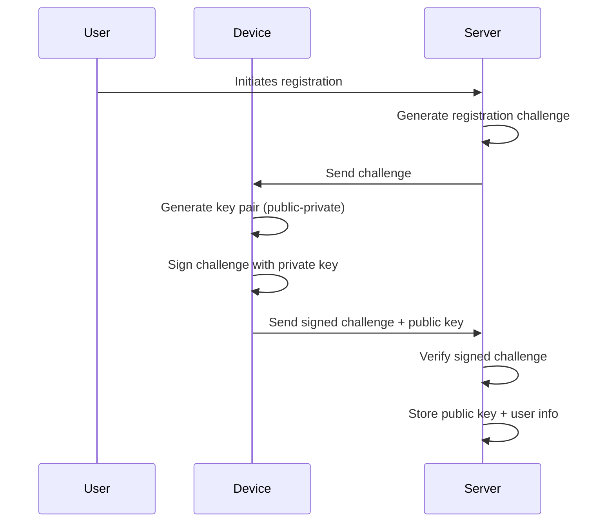
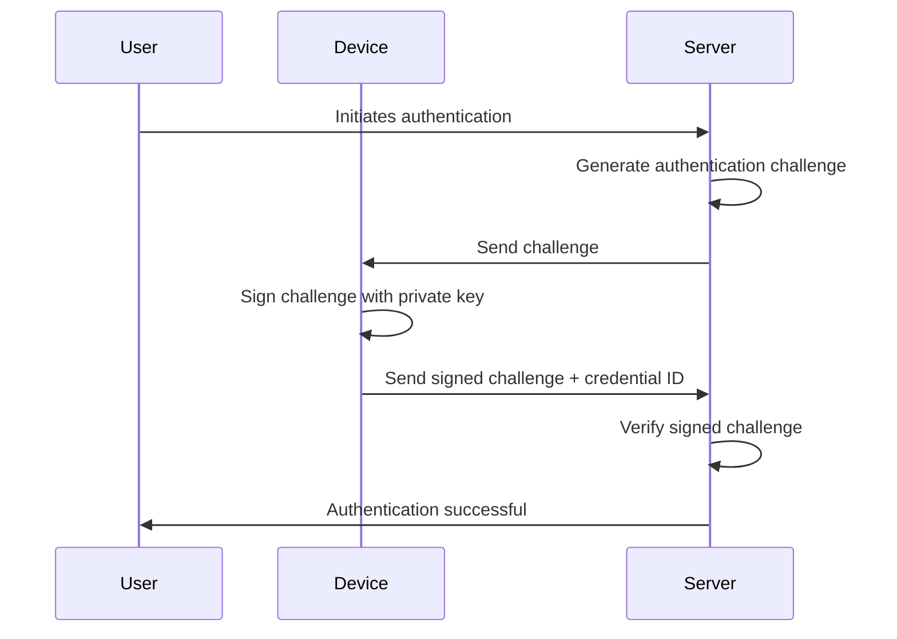

# Passkey (WebAuthn) Login in Spring Boot: Stateless Auth with JWT & Yubico: Developer's Guide

**TL;DR**: This guide provides a comprehensive overview of implementing stateless passkey authentication in Spring Boot
applications using Yubico's Java WebAuthn server and JWT for secure user authentication. It covers the benefits of
using passkeys, the limitations of Spring Security's built-in support, and how to leverage Yubico's library for a
robust and flexible implementation.

## Introduction

[**Passkeys**](https://passkey.org/) are a modern alternative to passwords, built
on [Public Key Cryptography](https://en.wikipedia.org/wiki/Public-key_cryptography). Supported
by all major browsers and platforms, they offer phishing-resistant authentication that's seamless and secure.

In this guide, we implement **stateless passkey authentication** using Spring
Boot, [Yubico's Java WebAuthn server](https://developers.yubico.com/java-webauthn-server/), and [JWT](https://jwt.io/)
ideal for APIs, SPAs, and microservices.

!!! warning "Disclaimer"

    This article is intended for educational purposes and may not cover all aspects of passkey authentication.
    Always refer to the official documentation of [WebAuthn](https://www.w3.org/TR/webauthn/) and best practices
    when implementing security features in production applications.

## Why not use Spring Security's built-in passkey support?

[Spring Security](https://spring.io/projects/spring-security) has been evolving to support passkey authentication.
Spring Security provides a convenient way to
handle [passkey authentication](https://docs.spring.io/spring-security/reference/servlet/authentication/passkeys.html)
and integrates well with the Spring ecosystem. Spring Security uses
[webauthn4j](https://github.com/webauthn4j/webauthn4j) for passkey authentication which performs heavy lifting, such as
validating the passkey, managing the registration process, and handling the authentication flow.

However, it is designed to work with a session-based authentication model(as of Spring Security(6.5) at the time of
writing this article). It requires a session for **PublicKeyCredentialCreationOptionsRepository.java** and
**PublicKeyCredentialRequestOptionsRepository.java**. This means that it stores the authentication state in the user's
session, which is not suitable for applications that prefer stateless authentication mechanisms like JWT. Stateless
authentication is preferred in modern applications such as microservices, Self-Contain Systems, REST APIs, and
single-page applications (SPAs) for scalability and performance reasons.

!!! note "Note"

      It is possible to have own custom implementation for **PublicKeyCredentialCreationOptionsRepository.java** instead
      of using session-based storage, but **PublicKeyCredentialRequestOptionsRepository.java** is still tied to session
      storage, which makes it challenging to implement a fully stateless passkey authentication system using Spring Security.

To implement passkey authentication, we need to configure spring web security as follows:

```java

@Bean
SecurityFilterChain webauthnFilterChain(HttpSecurity http, WebAuthnSecurityProperties webAuthnProperties) throws Exception {
    return http
            .authorizeHttpRequests(request -> request.anyRequest().authenticated())
            .cors(Customizer.withDefaults())
            .formLogin(Customizer.withDefaults())
            .webAuthn(webauthn -> webauthn
                    .allowedOrigins(webAuthnProperties.allowedOrigins())
                    .rpId(webAuthnProperties.rpId())
                    .rpName(webAuthnProperties.rpName())
            )
            .build();
}

```

By default, Spring Security uses in-memory based `PublicKeyCredentialUserEntityRepository`. You can configure it to use
a persistent storage solution like a database or Redis by implementing the `PublicKeyCredentialUserEntityRepository`.

Please refer to the
[Spring Security documentation](https://docs.spring.io/spring-security/reference/servlet/authentication/passkeys.html)
for more details on configuring passkey authentication.

## Why Use Yubico's Library?

As mentioned earlier, Spring Security's built-in passkey support relies on session-based storage for the
authentication state, which is not ideal for stateless applications. To overcome this limitation, we can use
[Yubico's Java WebAuthn server](https://developers.yubico.com/java-webauthn-server/), which provides a robust and
flexible implementation of the WebAuthn protocol that can be easily integrated into a Spring Boot application.

The library handles the complexities of the WebAuthn protocol, such as registration, authentication, and credential
management, allowing you to focus on building your application. It provides greater flexibility in terms of
authentication flow, storage options, and integration with other components of your application.

Yubico's Java WebAuthn server is designed to be stateless and framework-agnostic, making it suitable for a wide range
of applications, including microservices, REST APIs, and single-page applications (SPAs).

## Implementation

Passkey authentication involves two main steps: **registration** and **authentication**.

1. **Registration**: The user registers a passkey with the server. This involves generating a public-private key pair,
   where the private key is stored securely on the user's device, and the public key is sent to the server for storage.
2. **Authentication**: When the user attempts to log in, the server sends a challenge to the user's device. The device
   uses the private key to sign the challenge, and the signed response is sent back to the server for verification.

!!! tip "Tip"

      You can use passkey playgrounds like [webauthn.io](https://webauthn.io/) and [webauthn.me](https://webauthn.me/).
      These tools provides user-friendly interface that allows you to understand passkey registration and authentication
      flows in a web browser, making it easier to grasp the concepts and flow of passkey authentication.

During the registration and authentication process, the server generates a challenge that the user's device must sign.
This challenge is a random and unique value that ensures the authentication process is secure and prevents replay
attacks.

Since we are implementing stateless authentication, we need to store the challenge temporarily in a persistent storage
(like Redis or Database) that can be retrieved during the registration and authentication process.
This allows us to verify the signed challenge during authentication without relying on session state.

### Registration Flow

Registration is the process of creating a new passkey for a user. The following sequence diagram illustrates the
registration flow:



1. The user **initiates the registration** process by providing their username.
2. The server **creates a registration challenge**, including configuration options (like authenticator selection
   criteria), and sends it to the user's device. At the same time, the server temporarily stores the challenge and
   related options, which will be used later to verify the response.
3. The user's device **generates a new public-private key pair** and uses the private key to **sign the challenge**.
4. The device sends the **signed challenge and public key** back to the server.
5. The server **verifies the signature** using the original challenge data and, upon successful validation, **stores the
   public key and user details** in persistent storage (e.g. database) for future authentication.

**Step 1: Set up spring boot application with Yubico's Java WebAuthn server dependency**

First, add the Yubico Java WebAuthn server dependency to your `pom.xml`:

```xml

<dependencies>
    <!--Spring Boot Starter dependencies-->
    <dependency>
        <groupId>org.springframework.boot</groupId>
        <artifactId>spring-boot-starter-web</artifactId>
    </dependency>
    ...

    <dependency>
        <groupId>com.yubico</groupId>
        <artifactId>webauthn-server-core</artifactId>
        <version>${webauthn-server-core.version}</version>
        <scope>compile</scope>
    </dependency>
</dependencies>
```

**Step 2: Create a configuration class to set up the WebAuthn server and its dependencies**

- **WebAuthnConfigurationProperties.java**: This class holds the configuration properties for the WebAuthn server.
- **RelyingParty**: This is the main class that represents the relying party (your application) in the WebAuthn
  protocol.
- **PublicKeyCredentialRepository**: This is an interface that you need to implement to manage user credentials (public
  keys).
- **PublicKeyCredentialCreationOptionRepository**: This interface is used to store the options for credential
  creation i.e. Passkey registration.
- **AssertionRequestRepository**: This interface is used to store the assertion requests i.e. Passkey
  authentication requests.
- **WebAuthnService**: This is a service class that handles the WebAuthn operations such as registration and
  authentication. We will implement this class to handle the registration and authentication flows.

```java

@Configuration(proxyBeanMethods = false)
@EnableConfigurationProperties({WebAuthnConfigurationProperties.class})
public class WebAuthnConfig {

    @Bean
    RelyingParty relyingParty(
            WebAuthnConfigurationProperties properties,
            CredentialRepository credentialRepository) throws InvalidAppIdException {

        RelyingPartyIdentity identity = RelyingPartyIdentity.builder()
                .id(properties.rpId())
                .name(properties.rpName())
                .build();

        return RelyingParty.builder()
                .identity(identity)
                .credentialRepository(credentialRepository)
                .allowOriginPort(true)
                .origins(Set.of(properties.origin()))
                .build();
    }

    @Bean
    PublicKeyCredentialRepository publicKeyCredentialRepository(UserPublicKeyCredentialRepository credentialRepository) {
        return new PersistencePublicKeyCredentialRepository(credentialRepository);
    }

    @Bean
    PublicKeyCredentialCreationOptionRepository publicKeyCredentialCreationOptionRepository() {
        return new InMemoryPublicKeyCredentialCreationOptionRepository();
    }

    @Bean
    AssertionRequestRepository assertionRequestRepository() {
        return new InMemoryAssertionRequestRepository();
    }

    @Bean
    WebAuthnService webAuthnService(RelyingParty relyingParty,
                                    PublicKeyCredentialRepository publicKeyCredentialRepository,
                                    PublicKeyCredentialCreationOptionRepository creationOptionRepository,
                                    AssertionRequestRepository assertionRequestRepository) {
        return new WebAuthnService(relyingParty, publicKeyCredentialRepository, creationOptionRepository, assertionRequestRepository);
    }

}

```

**Step 3: Implement the `WebAuthnService` class to handle registration**

```java

@Slf4j
@RequiredArgsConstructor
public class WebAuthnService {
    private final RelyingParty relyingParty;
    private final PublicKeyCredentialRepository credentialRepository;
    private final PublicKeyCredentialCreationOptionRepository creationOptionRepository;

    public PublicKeyCredentialCreationOptions startRegistration(AuthUser user) {
        UserIdentity userIdentity = UserIdentity.builder()
                .name(user.getUsername())
                .displayName(user.getName())
                .build();

        AuthenticatorSelectionCriteria authenticatorSelectionCriteria = AuthenticatorSelectionCriteria.builder()
                .residentKey(ResidentKeyRequirement.REQUIRED)
                .userVerification(UserVerificationRequirement.REQUIRED)
                .build();

        StartRegistrationOptions options = StartRegistrationOptions.builder()
                .user(userIdentity)
                .authenticatorSelection(authenticatorSelectionCriteria)
                .build();

        PublicKeyCredentialCreationOptions creationOptions = relyingParty.startRegistration(options);
        log.info("Registration options created for user: {}", user.getUsername());
        creationOptionRepository.save(user, creationOptions);
        return creationOptions;
    }

    public void finishRegistration(AuthUser user,
                                   PublicKeyCredential<AuthenticatorAttestationResponse, ClientRegistrationExtensionOutputs> publicKeyCredential,
                                   HttpClientRequestInfo requestInfo)
            throws RegistrationFailedException {
        PublicKeyCredentialCreationOptions creationOptions = creationOptionRepository.get(user);

        FinishRegistrationOptions options = FinishRegistrationOptions.builder()
                .request(creationOptions)
                .response(publicKeyCredential)
                .build();

        RegistrationResult result = relyingParty.finishRegistration(options);
        log.info("Registration successful for user: {}, credential ID: {}", user.getUsername(), result.getKeyId());

        // Here you would typically save the result to your database
        RegisteredCredential credential = RegisteredCredential.builder()
                .credentialId(result.getKeyId().getId())
                .userHandle(creationOptions.getUser().getId())
                .publicKeyCose(result.getPublicKeyCose())
                .signatureCount(result.getSignatureCount())
                .build();

        CredentialMetadata credentialMetadata = CredentialMetadata.builder()
                .createdAt(LocalDateTime.now())
                .name(creationOptions.getUser().getDisplayName())
                .deviceInfo(requestInfo.deviceInfo())
                .username(user.getUsername())
                .userHandle(creationOptions.getUser().getId())
                .build();

        credentialRepository.addCredential(credential, credentialMetadata);

        creationOptionRepository.delete(user);
        log.info("Credential added for user: {}, credential ID: {}", user.getUsername(), credential.getCredentialId());
    }

}

```

!!! note "Note"

    -  `AuthUser` as a custom user class that holds user information. You can replace it with your own 
        user class or use Spring Security's `UserDetails` interface.
    -  `CredentialMetadata` is a custom class that holds
        metadata about the credential, such as creation time, device info, username, etc. You can customize it based on your
        application's requirements.

**Step 4: Implement the `PublicKeyCredentialCreationOptionRepository` interface to store the registration options**

Server needs to store the registration options temporarily so that it can verify the response when the user completes
the registration. We can use an in-memory repository or a persistent storage solution like Redis or a database.

In this example, we will use an in-memory repository for simplicity.

```java

@RequiredArgsConstructor
@Slf4j
public class InMemoryPublicKeyCredentialCreationOptionRepository implements PublicKeyCredentialCreationOptionRepository {
    private static final Map<String, PublicKeyCredentialCreationOptions> store = new HashMap<>();

    public void save(AuthUser user, PublicKeyCredentialCreationOptions options) {
        store.put(user.getUsername(), options);
        log.info("Saved PublicKeyCredentialCreationOptions for user: {}", user.getUsername());
    }

    public PublicKeyCredentialCreationOptions get(AuthUser user) {
        PublicKeyCredentialCreationOptions options = store.get(user.getUsername());
        log.info("Retrieved PublicKeyCredentialCreationOptions for user: {} exists:{}", user.getUsername(), options != null);
        return options;
    }

    public void delete(AuthUser user) {
        store.remove(user.getUsername());
        log.info("Deleted PublicKeyCredentialCreationOptions for user: {}", user.getUsername());
    }

}

```

**Step 5: Implement the `PublicKeyCredentialRepository` interface to manage user credentials**

We need to implement `CredentialRepository` interface from Yubico library to manage user credentials. Usually, this
involves storing the public key and other credential metadata in a persistent storage solution like a database.

To store those credentials,

- create an entity `UserPublicKeyCredentialEntity` to manage credentials
- create a repository `UserPublicKeyCredentialRepository` store credentials in a database
- create custom repository `PublicKeyCredentialRepository` that extends mandatory `CredentialRepository` interface from
  Yubico's library
- create `PersistencePublicKeyCredentialRepository` to implement the `PublicKeyCredentialRepository` interface to manage
  user credentials

Let's create an entity class `UserPublicKeyCredentialEntity` to represent the user credentials:

```java

@Data
@Builder
@NoArgsConstructor
@AllArgsConstructor
@Document(collection = "public-key-credentials")
public class UserPublicKeyCredentialEntity {
    @Id
    private String id;
    private String username;
    private String userHandle;
    private String credentialId;
    private String publicKeyCose;
    private long signatureCount;
    private String name;
    private String deviceInfo;
    private LocalDateTime createdAt;
}

```

Next, we will create the `UserPublicKeyCredentialRepository` repository to manage user credentials:

```java
public interface UserPublicKeyCredentialRepository extends MongoRepository<UserPublicKeyCredentialEntity, String> {

    List<UserPublicKeyCredentialEntity> findByUsername(String username);

    List<UserPublicKeyCredentialEntity> findByCredentialId(String credentialId);

    Optional<UserPublicKeyCredentialEntity> findByCredentialIdAndUserHandle(String credentialId, String userHandle);

    Optional<UserPublicKeyCredentialEntity> findByUserHandle(String userHandle);

    void deleteByUsernameAndCredentialId(String username, String credentialId);

}
```

Next, we create `PublicKeyCredentialRepository` interface to extend the mandatory `CredentialRepository` interface:

```java
public interface PublicKeyCredentialRepository extends CredentialRepository {
    void addCredential(RegisteredCredential credential, CredentialMetadata credentialMetadata);

    List<StoredCredentialInformation> getCredentials(String username);

    void removeCredential(String username, ByteArray credentialId);
}
```

Next, we will implement the `PublicKeyCredentialRepository` interface in a class called
`PersistencePublicKeyCredentialRepository`:

```java

@Slf4j
@RequiredArgsConstructor
public class PersistencePublicKeyCredentialRepository implements PublicKeyCredentialRepository {
    private final UserPublicKeyCredentialRepository credentialRepository;

    @Override
    public void addCredential(RegisteredCredential credential, CredentialMetadata metadata) {
        UserPublicKeyCredentialEntity entity = UserPublicKeyCredentialEntity.builder()
                .name(metadata.name())
                .createdAt(metadata.createdAt())
                .username(metadata.username())
                .userHandle(metadata.userHandle().getBase64())
                .credentialId(credential.getCredentialId().getBase64())
                .publicKeyCose(credential.getPublicKeyCose().getBase64())
                .signatureCount(credential.getSignatureCount())
                .deviceInfo(metadata.deviceInfo())
                .build();
        credentialRepository.save(entity);
        log.info("Added credential for user: {}, credential ID: {}", metadata.username(), credential.getCredentialId());
    }

    @Override
    public List<StoredCredentialInformation> getCredentials(String username) {
        return credentialRepository.findByUsername(username)
                .stream()
                .map(UserPublicKeyCredentialEntityConverter::toRegisteredCredential)
                .toList();
    }

    @Override
    public void removeCredential(String username, ByteArray credentialId) {
        credentialRepository.deleteByUsernameAndCredentialId(username, credentialId.getBase64());
        log.info("Removed credential for user: {}, credential ID: {}", username, credentialId);
    }

    @Override
    public Set<PublicKeyCredentialDescriptor> getCredentialIdsForUsername(String username) {
        Set<PublicKeyCredentialDescriptor> result = credentialRepository.findByUsername(username)
                .stream()
                .map(UserPublicKeyCredentialEntityConverter::toPublicKeyCredentialDescriptor)
                .collect(Collectors.toSet());

        log.info("Retrieved {} credential IDs for user: {}", result.size(), username);
        return result;
    }

    @Override
    public Optional<ByteArray> getUserHandleForUsername(String username) {
        List<UserPublicKeyCredentialEntity> credentials = credentialRepository.findByUsername(username);
        if (credentials.isEmpty()) {
            log.info("No user handle found for username: {}", username);
            return Optional.empty();
        }
        log.info("Found user handle for username: {}", username);
        return Optional.of(credentials.getFirst().getUserHandle()).map(ByteArray::fromBase64);
    }

    @Override
    public Optional<String> getUsernameForUserHandle(ByteArray userHandle) {
        Optional<UserPublicKeyCredentialEntity> entity = credentialRepository.findByUserHandle(userHandle.getBase64());
        if (entity.isPresent()) {
            String username = entity.get().getUsername();
            log.info("Found username: {} for user handle: {}", username, userHandle);
            return Optional.of(username);
        }
        log.info("No username found for user handle: {}", userHandle);
        return Optional.empty();
    }

    @Override
    public Optional<RegisteredCredential> lookup(ByteArray credentialId, ByteArray userHandle) {
        Optional<UserPublicKeyCredentialEntity> entity = credentialRepository.findByCredentialIdAndUserHandle(credentialId.getBase64(), userHandle.getBase64());
        if (entity.isPresent()) {
            log.info("Found credential with ID: {} for user handle: {}", credentialId, userHandle);
            return entity.map(UserPublicKeyCredentialEntityConverter::toRegisteredCredential).map(StoredCredentialInformation::credential);
        }
        log.info("No credential found with ID: {} for user handle: {}", credentialId, userHandle);
        return Optional.empty();
    }

    @Override
    public Set<RegisteredCredential> lookupAll(ByteArray credentialId) {
        List<UserPublicKeyCredentialEntity> entities = credentialRepository.findByCredentialId(credentialId.getBase64());
        if (entities.isEmpty()) {
            log.info("No credentials found with ID: {}", credentialId);
            return Set.of();
        }
        log.info("Found {} credentials with ID: {}", entities.size(), credentialId);
        return entities.stream()
                .map(UserPublicKeyCredentialEntityConverter::toRegisteredCredential)
                .map(StoredCredentialInformation::credential)
                .collect(Collectors.toSet());
    }
}

```

**Step 6: Create a controller to handle registration requests**

```java

@RestController
@RequestMapping("/webauthn/register")
@RequiredArgsConstructor
@Slf4j
public class WebAuthnRegistrationResource {
    private final UserDetailsService userDetailsService;
    private final WebAuthnService webAuthnService;


    @PostMapping("/start")
    public String startRegistration(Authentication authentication) throws JsonProcessingException {
        AuthUser userDetails = (AuthUser) userDetailsService.loadUserByUsername(authentication.getName());
        PublicKeyCredentialCreationOptions options = webAuthnService.startRegistration(userDetails);
        return options.toCredentialsCreateJson();
    }

    @PostMapping("/finish")
    public ResponseEntity<Void> finishRegistration(
            Authentication authentication,
            @RequestBody String publicKeyCredentialJson,
            @RequestHeader("User-Agent") String userAgent)
            throws IOException, RegistrationFailedException {
        AuthUser userDetails = (AuthUser) userDetailsService.loadUserByUsername(authentication.getName());
        HttpClientRequestInfo requestInfo = HttpClientRequestInfo.builder()
                .deviceInfo(HttpUtils.extractDeviceInfo(userAgent, userDetails.getName()))
                .build();
        PublicKeyCredential<AuthenticatorAttestationResponse, ClientRegistrationExtensionOutputs> publicKeyCredential =
                PublicKeyCredential.parseRegistrationResponseJson(publicKeyCredentialJson);
        webAuthnService.finishRegistration(userDetails, publicKeyCredential, requestInfo);
        return ResponseEntity.ok().build();
    }
}

```

!!! note "Note"

    Do not forget to adopt Spring Web Security to secure the registration endpoints. You can also use
    `@PreAuthorize` or `@Secured` annotations to restrict access to authenticated users only.

**Step 7: Test the registration flow**

You can test the registration flow using a simple HTML form or a JavaScript client that interacts with the
WebAuthn API. Here's a basic example of how to initiate the registration process:

```html

<!DOCTYPE html>
<html lang="en">
<head>
    <meta charset="UTF-8">
    <meta name="viewport" content="width=device-width, initial-scale=1.0">
    <title>Passkey Registration</title>
</head>
<body>
<h1>Passkey Registration</h1>
<form id="registrationForm">
    <input type="text" id="username" placeholder="Username" required>
    <button type="submit">Register Passkey</button>
</form>
</body>
</html>

```

In order parse the registration options and initiate the passkey registration, you can use JavaScript to make a request
to the `/webauthn/register/start` and `/webauthn/register/finish` endpoint:

My example uses the Angular framework, but you can adapt it to any JavaScript framework or vanilla JavaScript.

```typescript
register()
{
    const userContext = this.authService.getCurrentUserContext();
    const headers = {headers: {'Authorization': `Bearer ${userContext.accessToken}`}};

    return this.http.post<CredentialCreationOptionsJSON>(
        `${environment.baseUrl}/webauthn/register/start`, {flowId: uuidv4()}, headers)
        .pipe(
            switchMap((credentialCreateOptions) =>
                from(webauthnJson.create(credentialCreateOptions)).pipe(
                    switchMap((attestation) => this.http.post<boolean>(`${environment.baseUrl}/webauthn/register/finish`, attestation, headers))
                )
            )
        );
}
```

!!! tip "Tip"

    There are many libraries available to handle the WebAuthn API in JavaScript, such as
    [webauthn-json](https://github.com/github/webauthn-json) and [webauthn-simple](https://simplewebauthn.dev/).
    These libraries provide a simple interface to interact with the WebAuthn API and handle the registration and
    authentication flows.

### Authentication Flow

After the user has registered a passkey, they can authenticate using the following flow:



1. The user **initiates the authentication** process by providing their username.
2. The server **creates an authentication challenge** and sends it to the user's device. At the same time, the server
   temporarily stores the challenge, which will be used later to verify the response.
3. The user's device **signs the challenge** using the private key associated with the registered passkey.
4. The device sends the **signed challenge and credential ID** back to the server.
5. The server **verifies the signature** using the public key stored during registration. If the verification is
   successful, the user is authenticated and server generate JWT and returns it to client application.

**Step 1: Extend the `WebAuthnService` class to handle authentication**

```java

@Slf4j
@RequiredArgsConstructor
@NoCodeCoverageGenerated
public class WebAuthnService {
    private final RelyingParty relyingParty;
    private final PublicKeyCredentialRepository credentialRepository;
    private final PublicKeyCredentialCreationOptionRepository creationOptionRepository;
    private final AssertionRequestRepository assertionRequestRepository;

    // Existing registration methods...

    public PublicKeyCredentialRequestOptions startAssertion(String username) {
        StartAssertionOptions options = StartAssertionOptions.builder()
                .username(username)
                .userVerification(UserVerificationRequirement.PREFERRED)
                .build();

        AssertionRequest request = relyingParty.startAssertion(options);

        assertionRequestRepository.save(request.getPublicKeyCredentialRequestOptions().getChallenge(), request);

        log.info("Assertion options created and saved for user: {}", username);
        return request.getPublicKeyCredentialRequestOptions();
    }

    public AssertionResult finishAssertion(PublicKeyCredential<AuthenticatorAssertionResponse, ClientAssertionExtensionOutputs> publicKeyCredential)
            throws AssertionFailedException {

        ByteArray challenge = publicKeyCredential.getResponse().getClientData().getChallenge();
        AssertionRequest request = assertionRequestRepository.get(challenge);
        if (request == null) {
            throw new IllegalStateException("No assertion request found for challenge: " + challenge);
        }

        FinishAssertionOptions options = FinishAssertionOptions.builder()
                .request(request)
                .response(publicKeyCredential)
                .build();

        AssertionResult assertionResult = relyingParty.finishAssertion(options);
        log.info("Assertion successful for user with challenge: {}", challenge);

        assertionRequestRepository.delete(challenge);
        return assertionResult;
    }

}

```

**Step 2: Implement the `AssertionRequestRepository` interface to store the authentication requests**

we need to store the authentication requests temporarily so that we can verify the response when the user completes the
authentication. We can use an in-memory repository or a persistent storage solution like Redis or a database.

In this example, we will use an in-memory repository for simplicity.

Let's create an interface `AssertionRequestRepository` to define the methods for storing and retrieving:

```java
public interface AssertionRequestRepository {
    void save(ByteArray userHandle, AssertionRequest request);

    AssertionRequest get(ByteArray userHandle);

    void delete(ByteArray userHandle);
}
```

Next, we will implement the `AssertionRequestRepository` interface in a class called
`InMemoryAssertionRequestRepository`:

```java

@Slf4j
@RequiredArgsConstructor
@NoCodeCoverageGenerated
public class InMemoryAssertionRequestRepository implements AssertionRequestRepository {
    private final Map<ByteArray, AssertionRequest> store = new ConcurrentHashMap<>();

    @Override
    public void save(ByteArray challenge, AssertionRequest request) {
        requireNonNull(challenge, "Challenge must not be null");
        store.put(challenge, request);
        log.info("Saved AssertionRequest for challenge: {}", challenge);
    }

    @Override
    public AssertionRequest get(ByteArray challenge) {
        requireNonNull(challenge, "Challenge to look up must not be null");
        AssertionRequest request = store.get(challenge);
        log.info("Retrieved AssertionRequest for challenge: {} exists:{}", challenge, request != null);
        return request;
    }

    @Override
    public void delete(ByteArray challenge) {
        requireNonNull(challenge, "Challenge must not be null");
        store.remove(challenge);
        log.info("Deleted AssertionRequest for challenge: {}", challenge);
    }
}
```

**Step 3: Create a controller to handle authentication requests**

```java

@RestController
@RequestMapping("/webauthn/authenticate")
@RequiredArgsConstructor
@Slf4j
public class WebAuthnAuthenticationResource {
    private final WebAuthnService webAuthnService;
    private final UserDetailsService userDetailsService;
    private final JwtResponseProvider jwtResponseProvider;

    @PostMapping("/start")
    public String startAuthentication(@RequestParam String username) throws JsonProcessingException {
        PublicKeyCredentialRequestOptions options = webAuthnService.startAssertion(username);
        return options.toCredentialsGetJson();
    }

    @PostMapping("/finish")
    public ResponseEntity<LoginResponse> finishAuthentication(@RequestBody String publicKeyCredentialJson)
            throws IOException, AssertionFailedException {

        PublicKeyCredential<AuthenticatorAssertionResponse, ClientAssertionExtensionOutputs> publicKeyCredential =
                PublicKeyCredential.parseAssertionResponseJson(publicKeyCredentialJson);
        AssertionResult assertionResult = webAuthnService.finishAssertion(publicKeyCredential);

        if (!assertionResult.isSuccess()) {
            log.error("WebAuthn authentication failed: {}", assertionResult.getUsername());
            return ResponseEntity.badRequest().build();
        }

        AuthUser userDetails = (AuthUser) userDetailsService.loadUserByUsername(assertionResult.getUsername());
        return ResponseEntity.ok(jwtResponseProvider.jwtResponse(userDetails));
    }
}

```

!!! note "Note"

    - `JwtResponseProvider` is a custom class that generates JWT tokens for authenticated users. You can implement it
      based on your application's requirements.
    - `LoginResponse` is a custom class that holds the JWT token and other user information. You can customize it based
        on your application's requirements.

**Step 4: Test the authentication flow**

You can test the authentication flow using a simple HTML form or a JavaScript client that interacts with the
WebAuthn API. Here's a basic example of how to initiate the authentication process:

```html
<!DOCTYPE html>
<html lang="en">
<head>
    <title>Passkey Authentication</title>
    <meta charset="UTF-8">
    <meta name="viewport" content="width=device-width, initial-scale=1.0">
</head>
<body>
<h1>Passkey Authentication</h1>
<form id="authenticationForm">
    <input type="text" id="username" placeholder="Username" required>
    <button type="submit">Authenticate with Passkey</button>
</form>
</body>
</html>

```

In order to parse the authentication options and initiate the passkey authentication, you can use JavaScript to make a
request to the `/webauthn/authenticate/start` and `/webauthn/authenticate/finish` endpoint:

```typescript
authenticate()
{
    return this.http.post<CredentialRequestOptionsJSON>(
        `${environment.baseUrl}/webauthn/authenticate/start`,
        {username: username},
        {params: {username: username}}
    ).pipe(
        switchMap((optionsResponse) => from(webauthnJson.get(optionsResponse))),
        switchMap((assertion) => this.http.post<LoginResponse>(`${environment.baseUrl}/webauthn/authenticate/finish`, assertion))
    );
}

```

!!! tip "Tip"

    To implement production grade passkey authentication, you can refer 
    [:fontawesome-brands-youtube: Chrome for Developers: Sign-in form best practice](https://www.youtube.com/watch?v=alGcULGtiv8)

## Key Takeaways

- **Use client libraries for parsing JSON**: When implementing passkey authentication, use client libraries like
  [webauthn-json](https://github.com/github/webauthn-json) or [webauthn-simple](https://simplewebauthn.dev/) to parse
  the registration and authentication options. These libraries provide a simple interface to interact with the WebAuthn
  API and handle the registration and authentication flows.
- **Virtual Authenticators**: If you are testing passkey authentication in a test automation, consider
  using [Virtual Authenticators](https://www.selenium.dev/documentation/webdriver/interactions/virtual_authenticator/)
  provided by Selenium. This allows you to simulate passkey registration and authentication without needing
  physical hardware.
- **Chrome WebAuthn DevTools**: Use the [Chrome WebAuthn DevTools](https://developer.chrome.com/docs/devtools/webauthn)
  to test and debug your passkey implementation. The DevTools provide a user-friendly interface to simulate passkey
  registration and authentication, making it easier to understand the flow and troubleshoot any issues.
- **Autofill with Passkeys**: Consider implementing form autofill with passkeys in your web application. This can
  enhance the user experience by allowing users to quickly fill in their credentials without having to manually enter
  them. You can refer to
  the [:fontawesome-brands-youtube: Chrome for Developers: How to implement passkeys with form autofill in a web app](https://www.youtube.com/watch?v=_qSCYiU_Yr4)
  for more information on how to implement this feature.

## Conclusion

In this article, we explored how to implement passkey authentication using Yubico's Java WebAuthn server in a Spring
Boot application. We covered the registration and authentication flows, including how to handle challenges and responses
using the WebAuthn API.

Please refer following repositories for the complete code implementation:

- [Journey API: Spring RESTful Service](https://github.com/nramc/journey-api)
- [Journey Application: Angular Frontend](https://github.com/nramc/journeys)

## Resources

- [WebAuthn Specification](https://www.w3.org/TR/webauthn/)
- [:fontawesome-brands-youtube:Passkeys Explained: FIDO’s Passwordless Authentication Deep Dive](https://www.youtube.com/watch?v=fv20TDMWLC0)
- [:fontawesome-brands-youtube:Implementing passwordless logins using Passkey, WebAuthn protocols and spring authorization server](https://www.youtube.com/watch?v=qNy_Q9fth-4)
- [Yubico:java-webauthn-server](https://developers.yubico.com/java-webauthn-server/)