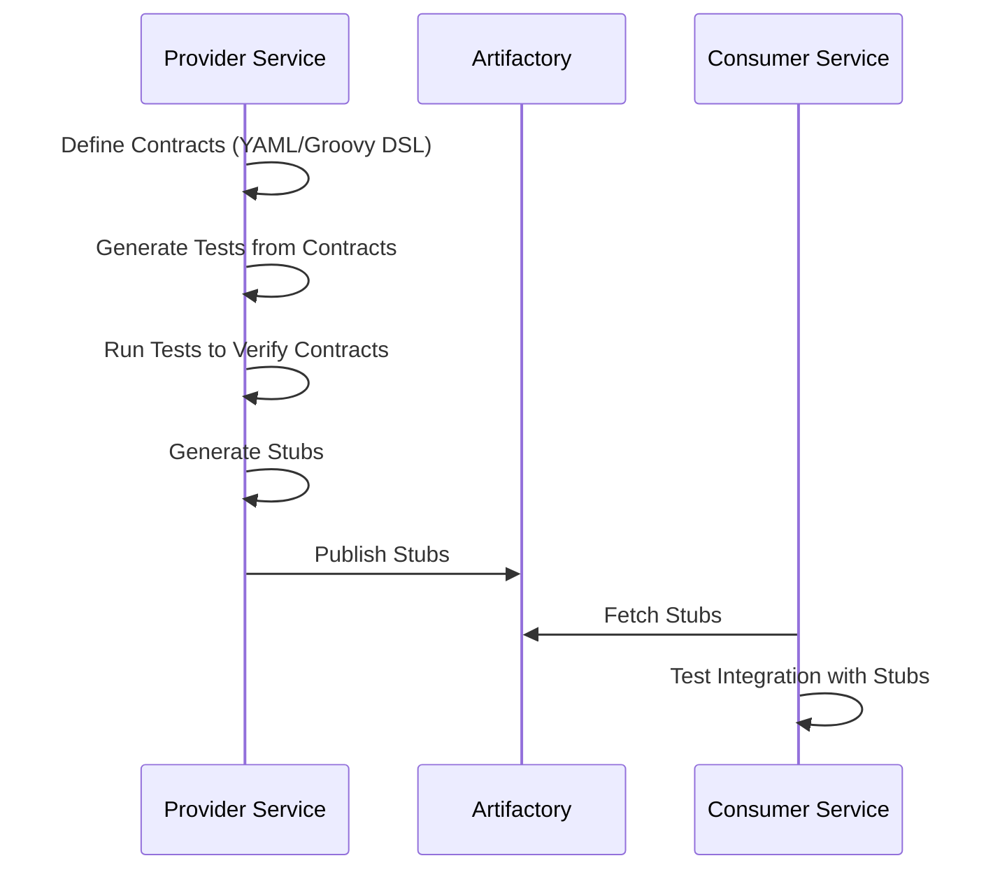

# Automating Contract Testing: A Developer’s Guide with Spring Cloud Contract

## Introduction

In Microservices architecture, **seamless communication between services** is essential. As systems grow in complexity,
traditional integration testing often struggles to catch issues early. This is where **Contract Testing** becomes
invaluable.

This guide explores [Spring Cloud Contract](https://docs.spring.io/spring-cloud-contract/reference/index.html), a robust
framework for implementing contract testing in Java-based microservices. Whether you're a beginner or looking to enhance
your skills, you'll find practical insights, examples, and best practices to master contract testing.

## What is Contract Testing?

**Contract Testing** is a testing approach that focuses on verifying the interactions between service providers and
consumers. It ensures that both parties adhere to the agreed-upon behavior, reducing integration issues and improving
collaboration, even when developed independently.

## Why Spring Cloud Contract?

**Spring Cloud Contract** simplifies contract testing by providing a full-fledged framework to **define, verify, and
share** contracts between service providers and consumers.

Key features of Spring Cloud Contract include:

- **Automation**: Automatically generates tests and stubs from contracts, saving time and effort.
- **Consumer-Driven Contracts**: Supports a consumer-first approach, ensuring APIs meet consumer expectations.
- **Stubbing**: Generates stubs for service providers, allowing consumers to test against a mocked version of the API.
- **Integration with Spring**: Seamlessly integrates with Spring Boot and other Spring projects, making it easy to adopt
  in existing applications.
- **Flexibility**: Supports multiple contract formats, including Java, Groovy DSL and YAML, catering to different team
  preferences.
- **CI/CD Friendly**: Easily integrates into CI/CD pipelines, enabling continuous verification of contracts.

## How Contract Testing Works ?

Spring Cloud Contract ensures seamless contract testing by automating the verification of interactions between service
providers and consumers.

Here's the workflow:



- **Define Contracts**: Write contracts in Groovy DSL or YAML format specifying request-response expectations.
- **Generate Tests**: Spring Cloud Contract generates provider-side tests from the contracts.
- **Run Tests**: Execute the generated tests to ensure the provider adheres to the contract.
- **Generate Stubs**: Stubs are created for consumers to simulate provider behavior.
- **Publish Stubs**: The provider publishes the generated stubs to an artifact repository.
- **Fetch Stubs**: The consumer fetches the stubs from the artifact repository.
- **Consumer Testing**: Consumers use the stubs to test their integration without relying on the actual provider.

## Provider Service

### Project Setup

To get started with Spring Cloud Contract, you need to configure your project with the necessary dependencies and
plugins. Below is a step-by-step guide to set up your project.

**1. Add Maven Dependencies**

Include the Spring Cloud Contract dependencies in your pom.xml file. These dependencies provide the core functionality
for contract testing.

```xml

<project>
    ...
    <properties>
        <spring-cloud-contract.version>4.2.1</spring-cloud-contract.version>
    </properties>
    ...
    <dependencyManagement>
        <dependencies>
            <dependency>
                <groupId>org.springframework.cloud</groupId>
                <artifactId>spring-cloud-dependencies</artifactId>
                <version>${spring-cloud-contract.version}</version>
                <type>pom</type>
                <scope>import</scope>
            </dependency>
        </dependencies>
    </dependencyManagement>
    ...
    <dependency>
        <groupId>org.springframework.cloud</groupId>
        <artifactId>spring-cloud-starter-contract-verifier</artifactId>
        <version>${spring-cloud-contract.version}</version>
    </dependency>
    ...
</project>

```

**2. Configure the Spring Cloud Contract Plugin**

Add the Spring Cloud Contract Maven plugin to your `pom.xml`. This plugin is responsible for generating test classes and
stubs from your contract files.

```xml

<build>
    <plugins>
        <plugin>
            <groupId>org.springframework.cloud</groupId>
            <artifactId>spring-cloud-contract-maven-plugin</artifactId>
            <version>${spring-cloud-contract.version}</version>
            <extensions>true</extensions>
            <configuration>
                <baseClassForTests>com.github.nramc.dev.journey.api.JourneyApiContractBase</baseClassForTests>
            </configuration>
        </plugin>
    </plugins>
</build>
```

!!! note "Note"

    Please refer to the [Spring Cloud Contract Maven Plugin](https://docs.spring.io/spring-cloud-contract/reference/maven-project.html#maven-configuration-options)
    to know more about the configuration options available for the plugin.

**3. Define a Base Test Class**

Create a base test class for your contract tests. This class will set up the necessary context for your tests and
configure RestAssured to use the Spring Web Application context.

```java
package com.github.nramc.dev.journey.api;

import com.github.nramc.dev.journey.api.config.TestContainersConfiguration;
import io.restassured.module.mockmvc.RestAssuredMockMvc;
import org.junit.jupiter.api.BeforeEach;
import org.springframework.beans.factory.annotation.Autowired;
import org.springframework.boot.test.context.SpringBootTest;
import org.springframework.context.annotation.Import;
import org.springframework.test.context.ActiveProfiles;
import org.springframework.web.context.WebApplicationContext;

@SpringBootTest(classes = {JourneyApiApplication.class})
@Import(TestContainersConfiguration.class)
@ActiveProfiles("test")
// Suppressing the warning for the test class as public visibility is required for contract tests
@SuppressWarnings("java:S5786")
public class JourneyApiContractBase {
    @Autowired
    WebApplicationContext context;

    @BeforeEach
    void setup() {
        RestAssuredMockMvc.webAppContextSetup(this.context);
    }
}
```

!!! note "Note"

    The `JourneyApiContractBase` class use `@SpringBootTest` and `@ActiveProfiles` annotations to load the complete
    Spring application context. This is not always required to perform contract tests. We can use `@MockMvcTest` to load
    only the required beans for the test. In the above example, we are using `@SpringBootTest` to load the complete 
    application context with testcontainer to test the complete API flow.

**4. Run Maven Command**

Execute the following Maven command to generate the contract tests and stubs:

```bash
mvn clean install
```

**Note**: Build might fail if you have not defined any contract files. You can skip the build by using the `-DskipTests`
flag.

This will generate **test classes** in the `target/generated-test-sources/contracts` directory and **stubs** in the
`target/stubs` directory.

With this setup, your project is ready to use Spring Cloud Contract for contract testing.

### Defining Contract

**Contracts** define the expected interactions between service providers and consumers.
In Spring Cloud Contract, these contracts can be written in **Groovy DSL or YAML** format.
They specify the request and response details for API endpoints, ensuring both parties adhere to the agreed behavior.

**1. Create the Contract File**

Contracts are typically placed in the `src/test/resources/contracts` directory. Below is an example of a contract
written in **YAML** format for a signup API endpoint:

```yaml
  request:
    method: POST
    url: /rest/signup
    body:
      "username": example-username@example.com
      "password": Strong@password123
      "name": "John Doe"
    headers:
      Content-Type: application/json
    matchers:
      body:
        - path: $.['username']
          type: by_regex
          value: "[a-zA-Z0-9._-]{8,20}@[a-zA-Z0-9]{3,20}\\.[a-zA-Z]{2,6}"
        - path: $.['password']
          type: by_regex
          value: "(?=.*[a-z])(?=.*[A-Z])(?=.*\\d)(?=.*[@.#$!%*?&^])[A-Za-z\\d@.#$!%*?&]{8,50}"
        - path: $.['name']
          type: by_regex
          value: "[a-zA-Z\\s]{3,50}"
  response:
    status: 201

```

**2. Contract File Structure**

- **Request**: Defines the HTTP method, URL, headers, and body.
- **Matchers**: Validates the request body using patterns (e.g., regex).
- **Response**: Specifies the expected status, headers, and body.

!!! tip "Tip"

    Please refer to the [Spring Cloud Contract's YML Schema](https://docs.spring.io/spring-cloud-contract/reference/yml-schema.html)
    for detailed information on the DSL syntax and available options.

**3. Organizing Contracts**

Organize contracts by grouping them into subdirectories based on functionality or API endpoints.

**For example**

```text
src/test/resources/contracts/
    /signup/
        - signup-contract.yaml
        - signup-invalid-request.yaml
    /login/
        - login-contract.yaml
        - login-invalid-request.yaml
    /userinfo/
        - userinfo-contract.yaml
        - userinfo-invalid-request.yaml
        
```

By defining contracts, you ensure clear communication between services and enable automated testing of API interactions.

### Generate and Verify Tests

Once you have defined the contract files, you can generate the test classes and stub files using the Spring Cloud
Contract Maven plugin. The plugin will read the contract files and generate the test classes and stub files based on
the contract definitions.

When you run the Maven command:

```bash
mvn clean install
```

It will generate the test class `ContractVerifierTest` in the `target/generated-test-sources/contracts` directory. The
test class will contain the contract tests for the API endpoints defined in the contract files. The generated test class
will use RestAssured to perform the API calls and assert the responses.

```java

package com.github.nramc.dev.journey.api;

import com.github.nramc.dev.journey.api.JourneyApiContractBase;
import com.jayway.jsonpath.DocumentContext;
import com.jayway.jsonpath.JsonPath;
import org.junit.jupiter.api.Test;
import org.junit.jupiter.api.extension.ExtendWith;
import io.restassured.module.mockmvc.specification.MockMvcRequestSpecification;
import io.restassured.response.ResponseOptions;

import static org.springframework.cloud.contract.verifier.assertion.SpringCloudContractAssertions.assertThat;
import static org.springframework.cloud.contract.verifier.util.ContractVerifierUtil.*;
import static com.toomuchcoding.jsonassert.JsonAssertion.assertThatJson;
import static io.restassured.module.mockmvc.RestAssuredMockMvc.*;

@SuppressWarnings("rawtypes")
public class ContractVerifierTest extends JourneyApiContractBase {

    @Test
    public void validate_signup_contract() throws Exception {
        // given:
        MockMvcRequestSpecification request = given()
                .header("Content-Type", "application/json")
                .body("{\"username\":\"example-username@example.com\",\"password\":\"Strong@password123\",\"name\":\"John Doe\"}");

        // when:
        ResponseOptions response = given().spec(request)

                .post("/rest/signup");

        // then:
        assertThat(response.statusCode()).isEqualTo(201);

    }
}

```

### Generate & Publish Stubs

Maven build command `mvn install` will also generate stub files in `journey-api-web/target/stubs` directory for
the API endpoints defined in the contract files.

The stub files will be in JSON format and contain the request and response details for the API endpoints.

These stub files packaged as jar files `journey-api-web/target/journey-api-web-1.0.1-SNAPSHOT-stubs.jar` and published
to the artifactory repository. These stub files can then be reused by other microservices to mock API responses during
testing.

Please find below the sample stub file
`journey-api-web/target/stubs/META-INF/com.github.nramc.dev.journey/journey-api-web/1.0.1-SNAPSHOT/mappings/signup-contract.json`
generated for the signup API endpoint.

```json
{
  "id": "9b4e7581-0d7c-4ba2-af50-f84efa624991",
  "request": {
    "urlPath": "/rest/signup",
    "method": "POST",
    "headers": {
      "Content-Type": {
        "equalTo": "application/json"
      }
    },
    "bodyPatterns": [
      {
        "matchesJsonPath": "$[?(@.['username'] =~ /([a-zA-Z0-9]{8,20}@[a-zA-Z0-9]{3,20}\\.[a-zA-Z]{2,6})/)]"
      },
      {
        "matchesJsonPath": "$[?(@.['password'] =~ /((?=.*[a-z])(?=.*[A-Z])(?=.*\\d)(?=.*[@.#$!%*?&^])[A-Za-z\\d@.#$!%*?&]{8,50})/)]"
      },
      {
        "matchesJsonPath": "$[?(@.['name'] =~ /([a-zA-Z\\s]{3,50})/)]"
      }
    ]
  },
  "response": {
    "status": 201,
    "transformers": [
      "response-template",
      "spring-cloud-contract"
    ]
  },
  "uuid": "9b4e7581-0d7c-4ba2-af50-f84efa624991"
}

```

## Consumer Service

The consumer microservice will use the stub files generated by provider to **mock** the API responses. The consumer
microservice will use [WireMock](https://wiremock.org/) to mock the API responses using the stub files.

### Project Setup

To set up the consumer microservice with Spring Cloud Contract, you need to add the following dependencies in your
`pom.xml` file.

```xml

<project>
    ...
    <properties>
        <spring-cloud-contract.version>4.0.0</spring-cloud-contract.version>
    </properties>
    ...
    <dependencyManagement>
        <dependencies>
            <dependency>
                <groupId>org.springframework.cloud</groupId>
                <artifactId>spring-cloud-dependencies</artifactId>
                <version>${spring-cloud-contract.version}</version>
                <type>pom</type>
                <scope>import</scope>
            </dependency>
        </dependencies>
    </dependencyManagement>
    ...
    <dependency>
        <groupId>org.springframework.cloud</groupId>
        <artifactId>spring-cloud-starter-contract-stub-runner</artifactId>
        <scope>test</scope>
    </dependency>
    ...
</project>
```

### Fetching Stubs

The stub files can be fetched from the artifactory repository using the Spring Cloud Contract Stub Runner.

There are two modes to fetch the stub files,

1. **Local Mode**: The stub files are downloaded from the local directory.
2. **Remote Mode**: The stub files are downloaded from the artifactory repository.

In this example, we will use the local mode to fetch the stub files.

Include the stub JAR in your `pom.xml` under the test scope,

```xml

<dependency>
    <groupId>com.github.nramc.dev.journey</groupId>
    <artifactId>journey-api-web</artifactId>
    <version>${journey-api.version}</version>
    <classifier>stubs</classifier>
    <scope>test</scope>
</dependency>
```

This will include the stub files in the classpath of the consumer service.

### Configure Stub Runner

The Stub Runner in Spring Cloud Contract allows you to fetch the stub files from the local directory or remote
repository and use them to mock the API responses.

There are various ways to configure the Stub Runner in your consumer service.

**1. Using `@AutoConfigureStubRunner` annotation**

You can use the `@AutoConfigureStubRunner` annotation to configure the Stub Runner in your test class. This will
automatically download the stub files from the local directory or remote repository and use them to mock the API
responses.

```java

@SpringBootTest(webEnvironment = SpringBootTest.WebEnvironment.NONE, classes = JourneyIntegrationApplication.class)
@ActiveProfiles("integration") // application specific profile to load context

@AutoConfigureStubRunner(
        ids = "com.github.nramc.dev.journey:journey-api-web:+:stubs:6565",
        stubsMode = StubRunnerProperties.StubsMode.LOCAL)
class JourneyApiContractsTest {
    // Test cases will be here  
}
```

**2. Using JUnit5 Extension**
You can also use the `StubRunnerExtension` to configure the Stub Runner in your test class. This will allow you to
configure the Stub Runner in a more flexible way and use it in your test class.

```java

@SpringBootTest(webEnvironment = SpringBootTest.WebEnvironment.NONE, classes = JourneyIntegrationApplication.class)
@ActiveProfiles("integration") // application specific profile to load context
class JourneyApiContractsTest {

    @RegisterExtension
    public static StubRunnerExtension stubRunnerExtension = new StubRunnerExtension()
            .downloadStub("com.github.nramc.dev.journey:journey-api-web:+:stubs:6565")
            .stubsMode(StubRunnerProperties.StubsMode.LOCAL);

    // Test cases will be here  
}

```

!!! note "Note"

    To use the remote mode, you need to set the `stubsMode` to `REMOTE` and provide the `repositoryRoot` URL.
    Please refer to the [Spring Cloud Contract Stub Runner](https://docs.spring.io/spring-cloud-contract/reference/project-features-stubrunner.html)  

### Writing Tests

Once you have configured the Stub Runner, you can write the consumer tests using RestAssured to perform the API calls
and assert the responses.

```java
package com.github.nramc.dev.journey.api.tests.testcase.contracts;

import com.github.nramc.dev.journey.api.tests.application.JourneyIntegrationApplication;
import io.restassured.RestAssured;
import org.junit.jupiter.api.Test;
import org.springframework.boot.test.context.SpringBootTest;
import org.springframework.cloud.contract.stubrunner.spring.AutoConfigureStubRunner;
import org.springframework.cloud.contract.stubrunner.spring.StubRunnerProperties;
import org.springframework.test.context.ActiveProfiles;

@SpringBootTest(webEnvironment = SpringBootTest.WebEnvironment.NONE, classes = JourneyIntegrationApplication.class)
@ActiveProfiles("integration") // application specific profile to load context

@AutoConfigureStubRunner(
        ids = "com.github.nramc.dev.journey:journey-api-web:+:stubs:6565",
        stubsMode = StubRunnerProperties.StubsMode.LOCAL)
class JourneyApiContractsTest {

    @Test
    void signup_whenSignupDataValid_shouldReturnSuccess() {
        RestAssured.given()
                .port(6565)
                .contentType("application/json")
                .accept("application/json")
                .body("""
                        {"username":"username@example.com", "password":"Strong@password123", "name":"John Doe"}
                        """)
                .post("/rest/signup")
                .then()
                .statusCode(201);
    }
}
```

### Running the Tests

To run the tests, you can use the following command:

```bash
mvn clean test
```

This will run the tests in the `JourneyApiContractsTest` class and use the stub files to mock the API responses.

## Conclusion

In this guide, we explored the fundamentals of contract testing and how to implement it using Spring Cloud Contract.

Contract testing is a game-changer in microservices architecture, ensuring seamless communication between services.
By automating contract testing, you can catch integration issues early, improve collaboration between teams, and enhance
the overall quality of your software.

You can further enhance your testing strategy by combining contract testing with API schema validation or
integrating it into your CI/CD pipeline for continuous feedback.

**Strong contracts build strong microservices.**

## References

- [Spring Cloud Contract](https://docs.spring.io/spring-cloud-contract/reference/index.html)
- [Spring Cloud Contract Maven Plugin](https://docs.spring.io/spring-cloud-contract/reference/maven-project.html)
- [WireMock](https://wiremock.org/)

