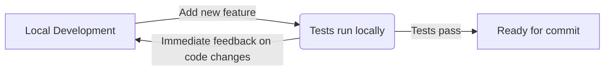
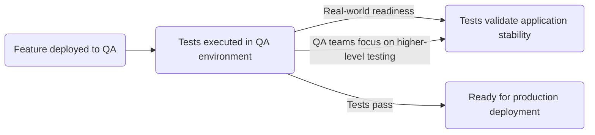
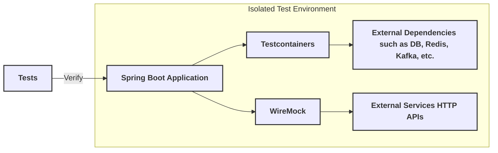

# Shift-Left Testing with Spring Boot and Testcontainers: A Comprehensive Guide

**TL;DR**: Shift-Left Testing is a software testing approach that emphasizes testing early in the development lifecycle.
With Spring Boot and Testcontainers, developers can detect integration issues early by running tests in isolated
environments during local development and CI/CD—instead of waiting for QA deployments. This approach ensures seamless
service interactions, faster feedback, and more reliable releases, reducing late-stage surprises and improving software
quality.

Inspiration & Credits: [Shift Lift Testing](https://www.ibm.com/think/topics/shift-left-testing)

## Introduction

In modern software development, testing early and often is crucial for delivering high-quality applications. [Shift-Left
Testing](https://www.ibm.com/think/topics/shift-left-testing) is a practice that emphasizes testing as early as possible
in the software development lifecycle. By catching
bugs early, teams can reduce costs, improve code quality, and speed up delivery cycles.

Spring Boot, with its test-friendly ecosystem, is well-suited for implementing Shift-Left Testing. Additionally,
Testcontainers, a library for providing lightweight, disposable containers for testing, enhances integration and
end-to-end testing by allowing developers to run real dependencies like databases, message brokers, and other external
services in a controlled environment.

In this article, we’ll explore how Spring Boot and Testcontainers help implement Shift-Left Testing efficiently.

## Understanding Shift-Left Testing

### What is Shift-Left Testing?

Shift-Left Testing is a software testing approach that emphasizes testing early in the development lifecycle. By moving
testing activities to the left (i.e., earlier in the process), teams can identify and fix issues sooner, reducing the
risk of defects reaching production.

To know more about Shift-Left Testing,
read [this comprehensive guide](https://www.ibm.com/think/topics/shift-left-testing).

### Why Shift-Left Testing Matters?

Traditional integration, security and performance testing often happen late in the software development lifecycle (e.g.,
after deployment to a
staging or QA environment). This can lead to:

❌ **Late discovery of critical bugs**  
❌ **High cost of fixing defects**  
❌ **Delays in delivery**

By applying shift-left testing with **SpringBoot** and **Testcontainers**, you create a production-like testing
environment **earlier** in development, reducing surprises later.

### Benefits of Shift-Left Testing?

✅ **Early Bug Detection** – Catching bugs early in development reduces the cost of fixing them later.

✅ **Faster Feedback Loops** – Developers get immediate feedback on code changes, enabling faster iterations.

✅ **Improved Code Quality** – By testing early and often, teams can deliver more reliable software.

✅ **Reduced Time to Market** – Faster testing cycles lead to quicker delivery of features and bug fixes.

### With Testcontainers

[Testcontainers](https://testcontainers.com/) is a Java library that enables developers to run real dependencies in
Docker containers within their test environment. This eliminates the need for in-memory databases and local
installations of services like PostgresSQL, Redis, Kafka, or Elasticsearch.

Testcontainers helps to bring integration testing closer to the development phase by:

✅ **Providing Realistic Testing Environments** – Instead of relying on in-memory databases (e.g., H2) or mocked
services, Testcontainers allow you to spin up actual services (PostgresSQL, Kafka, Redis, etc.), mirroring production.

✅ **Reducing Environment-Related Bugs** – Since tests run against real containers, they catch issues related to
configurations, dependencies, and network interactions early.

✅ **Ensuring Consistency Across Environments** – By using the same image in local development, CI/CD
pipelines, and QA environments, you maintain consistency and reduce surprises.

✅ **Enhancing End-to-End Testing** – Testcontainers can be used to test end-to-end scenarios involving multiple
services, databases, and external dependencies in isolated environment.

### With Spring Boot

[Spring Boot](https://spring.io/projects/spring-boot) is a popular Java framework that simplifies the development of
standalone, production-ready applications.

Key features that support Shift-Left Testing include:

🌟 **Test-Friendly Ecosystem** – Spring Boot provides robust support for writing unit, integration, and end-to-end tests.

🌟 **Dependency Injection** – Spring’s dependency injection mechanism allows you to mock or replace dependencies for
testing.

🌟 **Integration with JUnit, TestNG and Cucumber** – Spring Boot integrates seamlessly with popular testing frameworks,
enabling you to write and run tests easily.

🌟 **Profile Management** – Spring profiles help manage different configurations for development, testing, and
production.

🌟 **Externalized Configuration** – Spring Boot’s externalized configuration allows you to configure applications using
properties files, YAML files, environment variables, etc.

## Shift-Left Testing Strategy

**Disclaimer**: This strategy focuses exclusively on integration testing and end-to-end testing. It does not cover unit
testing approaches.

You can define a test suite for your Spring Boot application that covers all possible use cases and scenarios.
This test suite can be run at different stages of the development lifecycle:

### 1. Local Development Testing



- **Developers write integration tests** using Testcontainers to validate the application’s interactions with external
  services.
- **Testcontainers spin up real dependencies** (e.g., databases, message brokers) in Docker containers.
- **Tests run locally** to catch issues early in the development process.
- **Developers receive immediate feedback** on code changes.

### 2. CI/CD Integration Testing


- **CI/CD pipelines execute the same integration tests** against a Testcontainers-based environment.
- **Tests run automatically** on every code commit, ensuring consistent behavior across environments.
- **Developers receive feedback** on the integration of new code with existing services.
- **Issues are caught early** before merging changes into the main branch.

### 3. QA/Staging Testing



- **After passing integration tests**, the same test suite is executed against the deployed QA environment.
- **Tests validate real-world readiness** and ensure that the application behaves as expected in a production-like
  environment.
- **QA teams can focus on higher-level testing** (e.g., user acceptance testing) with confidence in the application’s
  stability.

## Challenges & Solutions

Implementing Shift-Left Testing strategy has some real time challenges;
Spring Boot with Testcontainers can help us to overcome them:

- **Maintaining Test Suite Consistency**: Ensuring test consistency across environments can be challenging.
  Spring Boot profiles and Configurations ensure the same test used across local, CI/CD, and QA, maintaining
  consistency.
- **Managing Test Data Parity**: Inconsistent test data can lead to unreliable results.
  Testcontainers ensures that tests run against real services, maintaining data parity across environments.
- **Handling External Dependencies**: Testing real integrations instead of mocks can be challenging.
  Testcontainers eliminates the need for mocks by providing actual services like databases, message brokers, ensuring
  more realistic tests.
- **Test Execution Time**: As the test suite grows, waiting for feedback can delay development.
  Testcontainers enables quick feedback by spinning up real services in containers, reducing the time it takes to run
  tests.
- **Managing Infrastructure for Testing**: Setting up environments manually is time-consuming.
  Testcontainers automates environment setup and teardown, ensuring a clean environment for each test and reducing
  manual overhead.
- **Flaky and Unstable Tests**: External dependencies and dynamic environments can cause flaky tests.
  Testcontainers provides stable, isolated environments, minimizing the risk of flaky tests.
- **Parallel Test Execution**: Running tests concurrently can cause resource conflicts if not properly isolated.
  Testcontainers provides an isolated application environment (via a container) for the entire suite, ensuring tests
  interact with a consistent setup without conflicting resources, even when tests run in parallel.
- **Ensuring Environment Parity**: Differences between environments can cause surprises. Testcontainers ensures
  consistency between local, CI/CD, and QA environments by using the same containerized services.
- **Database State Management**: Ensuring databases are properly seeded,
  cleaned up between test runs to avoid inconsistent results.
  Testcontainers helps by spinning up fresh, isolated databases for each test session, ensuring a
  clean state before each test and preventing data leakage between tests.

---

## Implementation

!!! note "Tip"

    It is highly recommended to create a separate Maven module for integration and end-to-end tests.
    This approach helps differentiate these tests from unit tests and improves maintainability by keeping the testing code organized.
    It also allows you to configure and manage dependencies specific to integration testing without interfering with the unit test setup.

Implementing Shift-Left Testing with Spring Boot and Testcontainers involves the following steps:

1. Setting Up Isolated Test Environment
2. Writing Test
3. Running Test Locally
4. Running Test in CI/CD Pipeline
5. Running Test in QA Environment

**1. Setting Up Isolated Test Environment**

Test environment setup is crucial for Shift-Left Testing.
For a consistent test environment, Testcontainers is used to spin up real external dependencies like databases and
message brokers in isolated Docker containers.
For external HTTP services, WireMock simulates API interactions, enabling tests to run against realistic service
behaviors without relying on third-party systems.
Together, these tools ensure accurate, reproducible tests in a controlled environment.

The following diagram illustrates the setup of an isolated test environment using Spring Boot, Testcontainers, and
WireMock:



To set up an isolated test environment using SpringBoot and Testcontainers,
first you need to add below dependencies to your project:

```xml

<dependencies>
    <!-- remember to add your source module dependency if it is a multi-module project.  -->
    <dependency>
        <groupId>com.github.nramc.dev.journey</groupId>
        <artifactId>journey-api-web</artifactId>
        <version>${project.version}</version>
    </dependency>
    ...
    <dependency>
        <groupId>org.springframework.boot</groupId>
        <artifactId>spring-boot-starter-test</artifactId>
        <scope>test</scope>
    </dependency>
    <dependency>
        <groupId>org.wiremock</groupId>
        <artifactId>wiremock-standalone</artifactId>
        <scope>test</scope>
    </dependency>

    <!-- preferred api client for testing -->
    <dependency>
        <groupId>io.rest-assured</groupId>
        <artifactId>rest-assured</artifactId>
    </dependency>

    <!-- preferred reporting tool   -->
    <dependency>
        <groupId>io.qameta.allure</groupId>
        <artifactId>allure-rest-assured</artifactId>
    </dependency>

    ...
</dependencies>
```

Next, you need to create a main class which serves as the entry point for running the Spring Boot application
with Testcontainers during integration testing. It overrides the default application context by using
`SpringApplication.from()` to load the main application and combines it with a custom `TestContainerConfig` class, which
configures the necessary containers for the test environment. This setup allows integration tests to run with real
external dependencies managed by Testcontainers.

```java

public class IntegrationApplication {
    public static void main(String[] args) {
        SpringApplication.from(Application::main)
                .with(TestContainerConfig.class)
                .run(args);
    }
}

```

**Managing Testcontainers Configuration**

Testcontainers can be configured in two ways, depending on project needs:

**Using TestContainerConfig.java (Programmatic Approach)**

The `TestContainerConfig` class configures the Testcontainers to spin up real external dependencies like databases,
message brokers, and other services required for integration testing.
The `@ServiceConnection` Spring Boot annotation initializes the Testcontainers for the specified service, ensuring that
the container is started before the application context is loaded and inject.

```java

@TestConfiguration(proxyBeanMethods = false)
public class TestContainerConfig {

    @Bean
    @ServiceConnection
    public ConfluentKafkaContainer kafkaContainer() {
        return new ConfluentKafkaContainer(DockerImageName.parse("confluentinc/cp-kafka:7.4.0")).withReuse(true);
    }

    @Bean
    @ServiceConnection
    public MongoDBContainer mongoDBContainer() {
        return new MongoDBContainer(DockerImageName.parse("mongo:latest"))
                .withExposedPorts(27017)
                .withReuse(true);
    }

}
```

**Using docker-compose.yml (Declarative Approach)**

Define services in a YAML file for consistency across environments.

```yaml
version: '3.8'
services:
  kafka:
    image: confluentinc/cp-kafka:7.4.0
    ports:
      - "9092:9092"
    environment:
      KAFKA_ADVERTISED_LISTENERS: PLAINTEXT://kafka:9092
  mongodb:
    image: mongo
    container_name: mongo
    ports:
      - "27017:27017"
    volumes:
      - data:/data
    environment:
      - MONGO_INITDB_ROOT_USERNAME=mongodb_user
      - MONGO_INITDB_ROOT_PASSWORD=mongodb_pwd

```

if you choose to use the declarative approach, then remember to add springboot docker compose dependency which takes
care of staring and stopping container before application start-up.

```xml

<dependency>
    <groupId>org.springframework.boot</groupId>
    <artifactId>spring-boot-docker-compose</artifactId>
</dependency>
```

Next, you need to define a spring profile for integration testing example `integration` and specify all relevant
configurations in either `application.yml` file or dedicated `application-integration.yml`.

```yml
spring:
  mail:
    username: noreply@journey.com
    password: test-password
    host: localhost
    port: 1025
    properties:
      mail.smtp.auth: false
      mail.smtp.starttls.enable: false
      mail.smtp.starttls.required: false

service:
  cloudinary:
    api-key: dummy-integration-test-api-key
    api-secret: dummy-integration-test-api-secret
    cloud-name: integration-test-cloud-name
    additional-properties:
      upload_preset: journey_integration_test
      # Wiremock URL for Cloudinary API stub
      upload_prefix: http://localhost:8090/cloudinary/api/

```

**Note**: If you check carefully, the above configuration does not include Database and Kafka configurations.
This is because `spring-boot-docker-compose` automatically fetch container details and inject them into spring context.

You can start the application by running the `IntegrationApplication` class with spring profile `integration`.
This will start the Spring Boot application with specified Testcontainers.

Next, to start and stop application automatically as part of maven lifecycle, you need to add Spring Boot mave plugin
with configuration.
Pre-integration-test phase is used to start the test application and post-integration-test phase is used to stop the
test application.

```xml

<plugins>
    <plugin>
        <groupId>org.springframework.boot</groupId>
        <artifactId>spring-boot-maven-plugin</artifactId>
        <executions>
            <execution>
                <id>pre-integration-test</id>
                <goals>
                    <goal>start</goal>
                </goals>
                <phase>pre-integration-test</phase>
                <configuration>
                    <mainClass>
                        com.github.nramc.dev.journey.api.testing.integration.application.IntegrationApplication
                    </mainClass>
                    <profiles>integration</profiles>
                </configuration>
            </execution>
            <execution>
                <id>post-integration-test</id>
                <goals>
                    <goal>stop</goal>
                </goals>
                <phase>post-integration-test</phase>
            </execution>
        </executions>
        <configuration>
            <!-- Additional classpath added to look for customized main class for integration application -->
            <useTestClasspath>true</useTestClasspath>
        </configuration>
    </plugin>
</plugins>
```

!!! note "Add test classpath to maven plugin configuration"

    - The `useTestClasspath` configuration ensures that the test classpath is included in the Maven plugin configuration.
      This allows the plugin to locate the customized main class for the integration application.
    - The `additionalClasspathElement` configuration can be used to specify additional classpath elements, ensuring that the plugin finds the   main class.

### Writing Test

!!! tip "Tip: Use JUnit 5 and Spring TestContext Framework"

    If you're interested in writing reusable logic for your tests, especially when actions need to be **conditionally** executed, you can leverage JUnit Extensions, as described in [**this article on JUnit Extension Conditional Execution**](https://nramc.github.io/my-notes/blog/junit-extension-conditional-execution.html). It explains how to conditionally perform actions based on factors like **Spring profiles**, **environment variables**, or **feature flags**. 

Next, Let's write a simple integration test using JUnit 5 and RestAssured to validate the health check endpoint of the
Spring Boot application.
This test will ensure that the application is up and running and that the health check endpoint returns a status of UP.

```java
class HelloWorldTest {

    @BeforeAll
    static void setup() {
        RestAssured.baseURI = "http://localhost:8080";
    }

    @Test
    void healthCheck_shouldBeAvailable_andShouldBeOK() {
        given()
                .get("/actuator/health")
                .then()
                .statusCode(HttpStatus.OK.value())
                .body("status", equalTo("UP"));
    }
}
```

### Running Test Locally

Since we start and stop the application as part of maven lifecycle `pre-integration-test` and `post-integration-test`
respectively, we need to run test in integration phase.
Enable and customize `maven-failsafe-plugin` as follows and optionally you can disable `maven-surefire-plugin`.

```xml

<plugins>
    ...
    <plugin>
        <groupId>org.apache.maven.plugins</groupId>
        <artifactId>maven-surefire-plugin</artifactId>
        <configuration>
            <skip>true</skip>
        </configuration>
    </plugin>

    <plugin>
        <groupId>org.apache.maven.plugins</groupId>
        <artifactId>maven-failsafe-plugin</artifactId>
        <configuration>
            <includes>
                <include>**/*Test.java</include> <!-- Matches classes ending with 'Test' -->
            </includes>
            <environmentVariables>
                <SPRING_PROFILES_ACTIVE>${testcase.spring.profiles}</SPRING_PROFILES_ACTIVE>
            </environmentVariables>
        </configuration>
    </plugin>

    ...
</plugins>
```

Now you can run the test using maven command as follows:

```bash
mvn clean verify 
```

!!! note "Note"

    - You can also run the test using IDE by running the `IntegrationApplication` class with the `integration` profile.
    - Wait until the Spring Boot application started successfully with Testcontainers.
    - And then execute the `HelloWorldTest` class.

### Adopting test for both Integration and QA suite

To run the same test in both integration and QA environments, you can use Spring profiles to manage different
configurations.

You can use conditional extensions to run the test based on the active profile.
Please refer to
the [JUnit Extension Conditional Execution](https://nramc.github.io/my-notes/blog/junit-extension-conditional-execution.html)
article for more details.

Let's create a test-suite-specific configuration with desired spring profiles.

```java

@TestConfiguration(proxyBeanMethods = false)
@EnableConfigurationProperties({EnvironmentProperties.class})
@PropertySource("classpath:integration-test.properties")
@Profile("integration-test")
public class IntegrationTestSuiteConfig {
    // Add any additional beans or configurations specific to the integration test suite
}

@TestConfiguration(proxyBeanMethods = false)
@EnableConfigurationProperties({EnvironmentProperties.class})
@PropertySource("classpath:qa-test.properties")
@Profile("qa-test")
public class QaTestSuiteConfig {
    // Add any additional beans or configurations specific to the QA test suite
}

```

Let's adopt the test to use the configurations and execute them for both integration and QA test suite.

```java

@SpringJUnitConfig(classes = {IntegrationTestSuiteConfig.class, QaTestSuiteConfig.class})
class HelloWorldTest {
    @Autowired
    EnvironmentProperties environmentProperties;

    @Test
    void healthCheck_shouldBeAvailable_andShouldBeOK() {
        given()
                .baseUri(environmentProperties.baseUrl())
                .get("/actuator/health")
                .then()
                .statusCode(HttpStatus.OK.value())
                .body("status", equalTo("UP"));
    }
}
```

During the development phase, you can run the test with the `integration-test` profile to validate the integration test
suite and `qa` profile to validate the QA test suite.

!!! note "Note"

    - `@SpringJUnitConfig` annotation from Spring Test Support is used to specify the configuration classes for the test suite.
    - Spring Core implementations does not support yml files, so you need to use `@PropertySource` to load the properties file.
    - You can also use `@SpringBootTest` annotation to load the application context with yml file and run the test if you prefer.

### Running Integration Test suite against isolated test environment

We have defined two properties `testcase.spring.profiles` to activate spring profile for test suite
and `integration.test.skip` to perform start/stop isolated application for integration testing.

```bash
mvn clean verify -Dtestcase.spring.profiles=integeration-test -Dintegration.test.skip=false
```

### Running QA Test suite against QA Environment

```bash
mvn clean verify -Dtestcase.spring.profiles=qa-test -Dintegration.test.skip=true
```

!!! tip "Make use of Maven Profile"

    You can also create a maven profile to run the test suite with the desired spring profile and skip the integration test.
    This way you can run the test suite with a single command without specifying the properties each time.

```xml"
<profiles>
  <profile>
    <id>integration-test</id>
    <properties>
      <integration.test.skip>false</integration.test.skip>
      <testcase.spring.profiles>integration-test</testcase.spring.profiles>
      </properties>
  </profile>
  <profile>
    <id>qa-test</id>
    <properties>
      <integration.test.skip>true</integration.test.skip>
      <testcase.spring.profiles>qa-test</testcase.spring.profiles>
    </properties>
  </profile>
</profiles>
```

Now you can run the test suite with the desired profile using the following command:

```bash

mvn clean verify -P integration-test
mvn clean verify -P qa-test
```

---

## Best Practices for Shift-Left Testing

- **Run integration tests as part of CI/CD pipelines** – Don't wait until QA; catch issues early.
- **Use dynamic configuration for test environments** – Ensure tests can switch between integration (Testcontainers) and
  QA applications seamlessly.
- **Leverage Spring profiles** – Use different profiles for local, CI/CD, and QA environments.
- **Mock only when necessary** – Prefer real dependencies over mocks to catch integration issues early.
- **Use realistic test data** – Ensure test data parity between local, CI/CD, and QA environments.
- **Monitor and optimize test execution time** – Shift-left should not slow down development; balance comprehensive
- **Ensure test repeatability** – Tests should be deterministic and produce the same results across different
  environments.
- **Automate database migrations in tests** – Apply schema migrations dynamically in test environments to validate
  database compatibility early.
- **Integrate contract testing** – Use tools like Pact to ensure API compatibility between microservices before
  deployment.
- **Parallelize test execution** – Speed up test runs by executing independent tests in parallel across multiple
  containers or services.
- **Enforce test coverage metrics** – Track test coverage to ensure critical application paths are well-tested.
- **Incorporate security and performance testing** – Shift-left applies beyond functionality; integrate basic security
  scans and performance benchmarks early.
- **Collect and analyze test results** – Implement logging and monitoring for test executions to identify flaky tests
  and bottlenecks

## Conclusion

Spring Boot and Testcontainers together empower teams to adopt Shift-Left Testing by enabling early, realistic, and
automated testing. By integrating Testcontainers into integration, developers can reduce the gap between local and
production environments, ensuring higher softwar quality and faster delivery cycles.

By shifting left, you detect issues earlier, cheaper, and faster—leading to better software, fewer surprises, and
smoother releases. Start using Testcontainers with Spring Boot today and enhance your testing strategy!

## Further Reading

- [Testcontainers Documentation](https://www.testcontainers.org/)
- [Spring TestContext Framework](https://docs.spring.io/spring-framework/reference/testing/testcontext-framework.html)
- [What is Shift-Left Testing?](https://www.ibm.com/think/topics/shift-left-testing)
- [Shift-Left Testing with Testcontainers: Catching Bugs Early with Local Integration Tests](https://www.docker.com/blog/shift-left-testing-with-testcontainers/)

