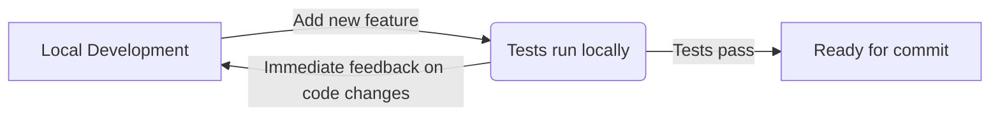
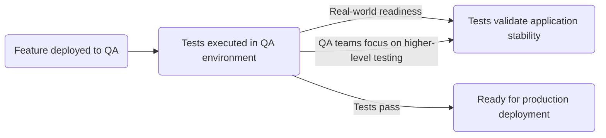

# Shift-Left Testing with Spring Boot and Testcontainers: A Conceptual Guide

## Introduction

In modern software development, testing early and often is crucial for delivering high-quality applications. [Shift-Left
Testing](https://www.ibm.com/think/topics/shift-left-testing) is a practice that emphasizes testing as early as possible
in the software development lifecycle. By catching
bugs early, teams can reduce costs, improve code quality, and speed up delivery cycles.

Spring Boot, with its test-friendly ecosystem, is well-suited for implementing Shift-Left Testing. Additionally,
Testcontainers, a library for providing lightweight, disposable containers for testing, enhances integration and
end-to-end testing by allowing developers to run real dependencies like databases, message brokers, and other external
services in a controlled environment.

In this article, we’ll explore how Spring Boot and Testcontainers help implement Shift-Left Testing efficiently.

## Understanding Shift-Left Testing

### What is Shift-Left Testing?

Shift-Left Testing is a software testing approach that emphasizes testing early in the development lifecycle. By moving
testing activities to the left (i.e., earlier in the process), teams can identify and fix issues sooner, reducing the
risk of defects reaching production.

To know more about Shift-Left Testing,
read [this comprehensive guide](https://www.ibm.com/think/topics/shift-left-testing).

### Why Shift-Left Testing Matters?

Traditional integration, security and performance testing often happen late in the software development lifecycle (e.g.,
after deployment to a
staging or QA environment). This can lead to:

❌ **Late discovery of critical bugs**  
❌ **High cost of fixing defects**  
❌ **Delays in delivery**

By applying shift-left testing with **SpringBoot** and **Testcontainers**, you create a production-like testing
environment **earlier** in development, reducing surprises later.

### Benefits of Shift-Left Testing?

✅ **Early Bug Detection** – Catching bugs early in development reduces the cost of fixing them later.

✅ **Faster Feedback Loops** – Developers get immediate feedback on code changes, enabling faster iterations.

✅ **Improved Code Quality** – By testing early and often, teams can deliver more reliable software.

✅ **Reduced Time to Market** – Faster testing cycles lead to quicker delivery of features and bug fixes.

### With Testcontainers

[Testcontainers](https://testcontainers.com/) is a Java library that enables developers to run real dependencies in
Docker containers within their test environment. This eliminates the need for in-memory databases and local
installations of services like PostgresSQL, Redis, Kafka, or Elasticsearch.

Testcontainers helps to bring integration testing closer to the development phase by:

✅ **Providing Realistic Testing Environments** – Instead of relying on in-memory databases (e.g., H2) or mocked
services, Testcontainers allow you to spin up actual services (PostgresSQL, Kafka, Redis, etc.), mirroring production.

✅ **Reducing Environment-Related Bugs** – Since tests run against real containers, they catch issues related to
configurations, dependencies, and network interactions early.

✅ **Ensuring Consistency Across Environments** – By using the same image in local development, CI/CD
pipelines, and QA environments, you maintain consistency and reduce surprises.

✅ **Enhancing End-to-End Testing** – Testcontainers can be used to test end-to-end scenarios involving multiple
services, databases, and external dependencies in isolated environment.

### With Spring Boot support

[Spring Boot](https://spring.io/projects/spring-boot) is a popular Java framework that simplifies the development of
standalone, production-ready applications.

Key features that support Shift-Left Testing include:

🌟 **Test-Friendly Ecosystem** – Spring Boot provides robust support for writing unit, integration, and end-to-end tests.

🌟 **Dependency Injection** – Spring’s dependency injection mechanism allows you to mock or replace dependencies for
testing.

🌟 **Integration with JUnit, TestNG and Cucumber** – Spring Boot integrates seamlessly with popular testing frameworks,
enabling you to write and run tests easily.

🌟 **Profile Management** – Spring profiles help manage different configurations for development, testing, and
production.

🌟 **Externalized Configuration** – Spring Boot’s externalized configuration allows you to configure applications using
properties files, YAML files, environment variables, etc.

## Shift-Left Testing Strategy

**Disclaimer**: This strategy focuses exclusively on integration testing and end-to-end testing. It does not cover unit
testing approaches.

You can define a test suite for your Spring Boot application that covers all possible use cases and scenarios.
This test suite can be run at different stages of the development lifecycle:

### 1. Local Development Testing

- **Developers write integration tests** using Testcontainers to validate the application’s interactions with external
  services.
- **Testcontainers spin up real dependencies** (e.g., databases, message brokers) in Docker containers.
- **Tests run locally** to catch issues early in the development process.
- **Developers receive immediate feedback** on code changes.

### 2. CI/CD Integration Testing

- **CI/CD pipelines execute the same integration tests** against a Testcontainers-based environment.
- **Tests run automatically** on every code commit, ensuring consistent behavior across environments.
- **Developers receive feedback** on the integration of new code with existing services.
- **Issues are caught early** before merging changes into the main branch.

### 3. QA/Staging Testing

- **After passing integration tests**, the same test suite is executed against the deployed QA environment.
- **Tests validate real-world readiness** and ensure that the application behaves as expected in a production-like
  environment.
- **QA teams can focus on higher-level testing** (e.g., user acceptance testing) with confidence in the application’s
  stability.

---

## Setting Up Spring Boot with Testcontainers
todo
---

## Best Practices for Shift-Left Testing

- **Run integration tests as part of CI/CD pipelines** – Don't wait until QA; catch issues early.
- **Use dynamic configuration for test environments** – Ensure tests can switch between integration (Testcontainers) and
  QA applications seamlessly.
- **Leverage Spring profiles** – Use different profiles for local, CI/CD, and QA environments.
- **Mock only when necessary** – Prefer real dependencies over mocks to catch integration issues early.
- **Use realistic test data** – Ensure test data parity between local, CI/CD, and QA environments.
- **Monitor and optimize test execution time** – Shift-left should not slow down development; balance comprehensive
- **Ensure test repeatability** – Tests should be deterministic and produce the same results across different
  environments.
- **Automate database migrations in tests** – Apply schema migrations dynamically in test environments to validate
  database compatibility early.
- **Integrate contract testing** – Use tools like Pact to ensure API compatibility between microservices before
  deployment.
- **Parallelize test execution** – Speed up test runs by executing independent tests in parallel across multiple
  containers or services.
- **Enforce test coverage metrics** – Track test coverage to ensure critical application paths are well-tested.
- **Incorporate security and performance testing** – Shift-left applies beyond functionality; integrate basic security
  scans and performance benchmarks early.
- **Collect and analyze test results** – Implement logging and monitoring for test executions to identify flaky tests
  and bottlenecks

## Conclusion

Spring Boot and Testcontainers together empower teams to adopt Shift-Left Testing by enabling early, realistic, and
automated testing. By integrating Testcontainers into integration, developers can reduce the gap between local and
production environments, ensuring higher softwar quality and faster delivery cycles.

By shifting left, you detect issues earlier, cheaper, and faster—leading to better software, fewer surprises, and
smoother releases. Start using Testcontainers with Spring Boot today and enhance your testing strategy!

## Further Reading

- [Testcontainers Documentation](https://www.testcontainers.org/)
- [Spring TestContext Framework](https://docs.spring.io/spring-framework/reference/testing/testcontext-framework.html)
- [Shift-Left Testing: A Comprehensive Guide](https://www.ibm.com/think/topics/shift-left-testing)
- [Shift-Left Testing with Testcontainers: Catching Bugs Early with Local Integration Tests](https://www.docker.com/blog/shift-left-testing-with-testcontainers/)

