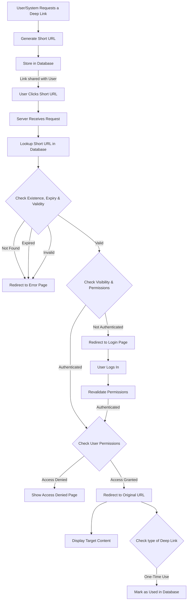

# Maximizing Web Application Usability with Deep Links

**TL;DR:** Deep links enable users to navigate directly to specific content within a web application, improving
accessibility, engagement, and efficiency.

---

## What Are Deep Links?

Deep linking is a technique that allows users to navigate directly to specific content or sections within a web
application. Unlike traditional links that simply open a homepage or landing page, deep links take users precisely where
they need to go—whether accessed through search engines, shared links, or marketing campaigns—enhancing accessibility
and user experience.

## Why Do We Need Deep Links?

1. **Enhanced User Experience** – Deep links eliminate unnecessary navigation by directing users to relevant content
   instantly.
2. **Improved Engagement & Retention** – Users are more likely to engage with your application when they can quickly
   find what they need.
3. **Marketing & SEO Benefits** – Deep linking improves discoverability in search engines and supports targeted
   campaigns.
4. **Cross-Platform Consistency** – Deep links can be used to create seamless transitions between web and mobile
   applications.

## Key Components of a Deep Link

A well-structured deep link should contain the following:

| Field            | Description                                                             |
|------------------|-------------------------------------------------------------------------|
| **Type**         | Defines the purpose (e.g., navigation, authentication, content access). |
| **Expiry Date**  | Controls the validity of the deep link, ensuring security.              |
| **Create Date**  | Tracks when the deep link was generated.                                |
| **Created By**   | Identifies the creator (user/system).                                   |
| **Short URL**    | A user-friendly, compact version of the original URL.                   |
| **Original URL** | The full-length target URL.                                             |
| **Visibility**   | Determines who can access the deep link (public, private, etc.).        |
| **Metadata**     | Additional information about the deep link (e.g., user, purpose).       |

Example:

```
Short URL: https://app.com/go/xyz123
Original URL: https://app.com/dashboard?section=reports&id=45
```

## Implementation Strategies



## Thinks to consider for Deep Links

**Security Measures**

- Validate and sanitize input to prevent injection attacks.
- Avoid exposing sensitive data in URLs.
- Encrypt sensitive data in deep links.
- Use HTTPS to secure data transmission.
- Use secure shortening services to generate short URLs.
- Implement signed links (JWT-based or hash-based security).
- Implement access controls to restrict unauthorized access.
- Implement rate limiting to prevent abuse.
- Monitor and log deep link usage for auditing.
- Regularly review and update deep links to maintain security.

**Performance Optimization**

- Optimize URL resolution for faster navigation.
- Cache frequently accessed deep links.
- Optimize URL resolution for faster redirection.

## Conclusion

Deep links are a powerful tool for improving accessibility, engagement, and retention in web applications. Whether for
marketing, seamless navigation, or enhancing user experience, implementing deep links ensures users reach the right
content effortlessly. By integrating deep linking strategically, businesses can maximize their web application’s
usability and effectiveness.

