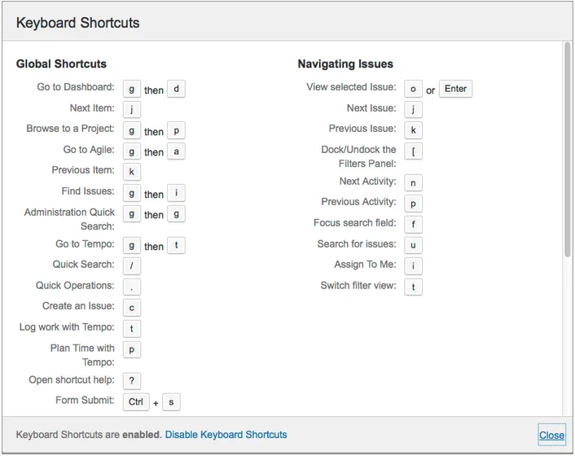

# Improve Web Application

## HotKeys - Keyboard Shortcuts

- [HotKeys](https://en.wikipedia.org/wiki/Keyboard_shortcut) improves user's UI/UX experience and boost productivity for
  any Web
  applications
- It is really helpful for web application like data entry websites and application having complex navigations
- One-line takeaways
    - Don’t override native browser (or OS) shortcuts
    - Support standard shortcuts that don’t contradict the previous rule, and use one or two letter shortcuts for other
      actions
    - Always have a consistent system
    - Pay maximum attention to discoverability
- e.g. JIRA supporting HotKeys,

  
